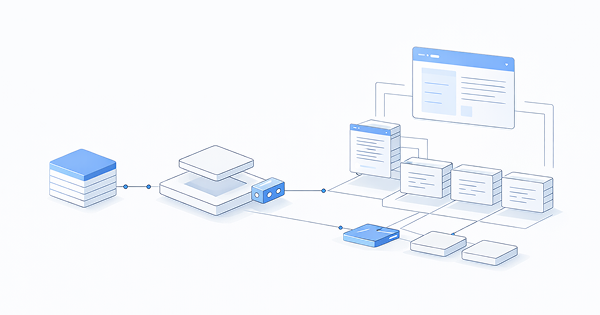

# Welcome to Retype

[Retype](https://retype.com/) is an :sparkles: ultra-high-performance :sparkles: generator that builds a website based on simple text files. Focus on your writing while Retype builds the rest.



No coding is required and just one Markdown file, such as a [`README.md`](https://www.makeareadme.com/), will get you started.

The [retype.com](https://retype.com/) website was generated using Retype. View the [source](https://github.com/retypeapp/retype/blob/main/README.md) used to generate this very page.

A new Retype powered website can be up and running within seconds once Retype is installed, which itself takes only a few seconds. :+1:

---

## Quick start

You can install Retype using `npm`, `yarn`, or the `dotnet` CLI.

From your command line, navigate to a folder location where you have one or more Markdown `.md` files, such as a GitHub project.

Next, choose one of the following tools to first install `retypeapp` and then start Retype by using the `retype watch` [command](/guides/cli.md#retype-watch):

+++ NPM
```
npm install retypeapp --global
retype watch
```
+++ Yarn
```
yarn global add retypeapp
retype watch
```
+++ dotnet
```
dotnet tool install retypeapp --global
retype watch
```
+++

That's it! Your new Retype website should be up and running.

!!!
You will require either [npm](https://www.npmjs.com/get-npm), [Yarn](https://classic.yarnpkg.com/en/docs/install/), or the [dotnet](https://dotnet.microsoft.com/download/dotnet-core) CLI to be installed before installing Retype. Only one of those three is required, although all three could be installed on your machine too. It's up to you. :raised_hands:

All operating systems are supported, including Mac, Windows, and Linux.
!!!

---

## Features

#### :icon-shield-check: It just works

Retype has been built to be easy to use and should _"just work"_ out-of-the-box without any special configuration or troublesome setup.

#### :icon-zap: Lightning fast

Don't blink. Retype was built for speed.

#### :icon-gear: Easy install

[Installation](/guides/getting-started.md) takes only a few seconds. Then all you need is one Markdown `.md` file which Retype will start building a new website from.

#### :icon-plug: Powerful

Project level [configuration](/configuration/project.md) using `retype.yml` unlocks many more Retype features and customization.

#### :icon-pencil: Simple formatting

Pages are [formatted](/guides/formatting.md) using Markdown syntax and Retype [components](/components/readme.md). Page level [configuration](/configuration/page.md) is available, such as setting a custom navigation [`label`](/configuration/page.md#label) or [`icon`](/configuration/page.md#icon).

#### :icon-sync: Live reload

If a change is detected, such as editing and saving an `.md` file, your Retype website will be updated almost instantly within the browser.

#### :icon-server: Host anywhere

Retype generates a basic HTML website that you can host on any web hosting service, or for free using [GitHub Pages](https://docs.github.com/en/github/working-with-github-pages/creating-a-github-pages-site). No special server-side software or external dependencies are required. You can host your Retype site as a public website or as a private website inside your organization.

---

## Support

Technical support questions are best asked in the [Discussions](https://github.com/retypeapp/retype/discussions). The discussions are monitored 24 hours a day and we will do our best to assist.

If you find a defect or would like to submit a feature request, please create an [Issue](https://github.com/retypeapp/retype/issues) and we will investigate right away.

Do you have a general inquiry? Please feel free to contact us at hello@retype.com.

We :heart: feedback.
