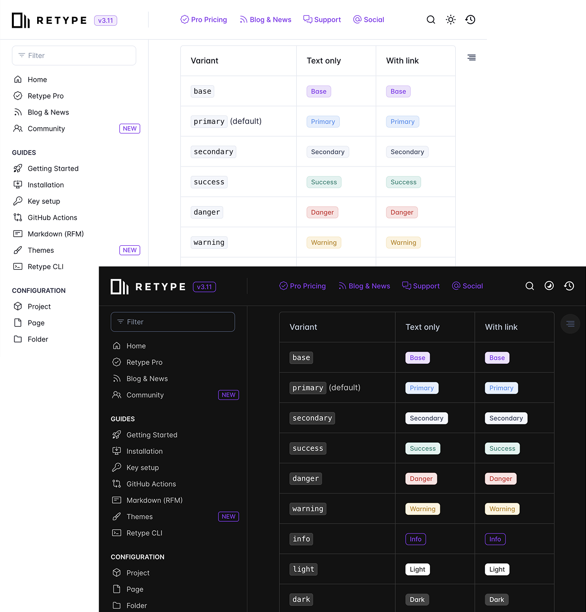
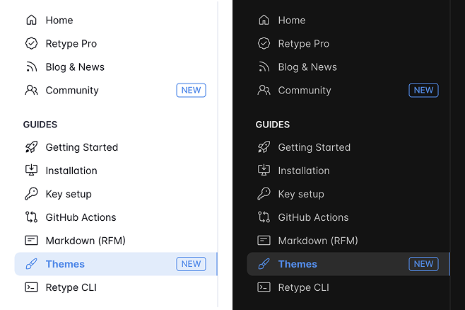
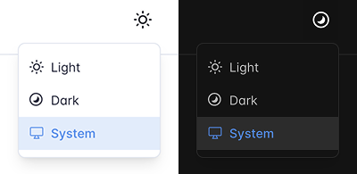
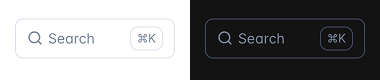

---
authors:
  - name: "@geoffreymcgill"
    email: geoff@retype.com
    link: https://github.com/retypeapp
category:
  - release
templating: false
---
# What's New in Retype v3.11


Retype `v3.11` puts you in control of your project's visual identity, while keeping everything fast, clean, and easy to use. This release brings Pro-level **theme** customization, smarter navigation, and faster syntax options to help you create documentation that feels more like your own.

See the full [[Changelog]] and [[Feature Log]] for a detailed list of updates in the `v3.11` release.

## Custom Themes

Take complete control over your documentation's visual design with the new [theme](/guides/themes.md) customization. This **Retype Pro** feature allows you to override any [theme variable](/configuration/theme-variables.md) for both `light` and `dark` modes, giving you flexibility in creating a unique brand experience.

!!!
This feature is a [!badge Pro|info] only feature and a Retype [key](/pro/pro.md) is required to enable.
!!!

### Consistent Design, Better Engagement

A consistent visual identity builds trust. Whether you are sharing internal documentation with your team or publishing a public-facing website for customers, your project should reflect the same branding standards as the rest of your organization. Colors, spacing, typography, and visual tone all influence how users perceive and navigate content.

### Configure Your Color

Set up custom themes in your `retype.yml` file starting with the Project [`theme`](/configuration/project.md#theme) setting and adding [[theme variables]]:

```yaml
theme:
  base:
    # Catppuccin Theme: Latte
    base-color: "#8839ef"
  dark:
    # Catppuccin Theme: Frappé
    base-color: "#ca9ee6"
```

Applying the above to the [retype.com](https://retype.com) website, we get a new _purple_ based theme color for the app elements in `light` and `dark` modes:

----

The theme system uses colors based on your `base-color` to automatically apply the colors for borders, hover states, backgrounds and to many more elements. Change the `base-color` and watch your entire project's color scheme update instantly.

!!!base Theme Variables Reference
See the complete [Theme Variables](/configuration/theme-variables.md) and [Themes guide](/guides/themes.md) for detailed `theme` configuration options.
!!!

## Quick Brand Color Setup

For teams that need a simple way to set their brand color without diving into full theme customization, the new [`branding.baseColor`](/configuration/project.md#basecolor) setting provides a streamlined approach.

!!!
This feature is a [!badge Pro|info] only feature and a Retype [key](/pro/pro.md) is required to enable.
!!!

```yaml
branding:
  baseColor: "#8839ef"
```

Setting `branding.baseColor` is equivalent to setting the `base-color` theme variable under the `theme.base` setting.

This single setting automatically applies your brand color to navigation highlights, links, and interactive elements throughout your site. It's perfect for getting started with brand customization before moving to more advanced theme configurations.

## Navigation Badges

Add visual indicators to your navigation items with the new Page level [`nav.badge`](/configuration/page.md#nav-badge) feature. A navigation badge is particularly useful for highlighting new content, marking beta features, or indicating content status.

!!!
This feature is a [!badge Pro|info] only feature and a Retype [key](/pro/pro.md) is required to enable.
!!!

The Badge configuration is added directly to the [[page#nav-badge|Page]] settings, ensuring your navigation badges stay with their content and won't get lost in separate configuration files.

```yaml
---
nav:
  badge:
    text: "NEW"
    variant: "info"
---
# Themes
```



The `badge` also supports the new `text|variant` pipe shorthand notation (see [below](#variant-pipe-notation-syntax)) for specifying both the `text` and `variant` of the Badge in one simple configuration:

```yaml
---
nav:
  badge: NEW|info
---
# Themes
```

Navigation badges support all the same variants and configuration options as regular [[badge]] components, including `corners`, `size`, `icon`, and **you can even configure the Badge to `link` to a different internal or external location**. The following demonstrates linking to an external website:

```yaml
---
nav:
  badge:
    text: NEW
    variant: info
    link: https://retype.com/
    corners: pill
---
# Themes
```

## Three-Way Color Scheme Switcher

-

The enhanced color scheme switcher now offers three options: **Light**, **Dark**, and **System**. This addresses a common user experience issue where visitors who manually select a color scheme preference want the ability to return to their system default.


The System option respects the user's operating system preference and automatically switches between light and dark modes based on their system settings. This creates a more intuitive experience that follows modern web standards.

!!!tip
In Retype `v3.8.0`, the [`scheme.mode`](/blog/2025-05-28-whats-new-in-retype-v39.md#dark-or-light-scheme) project setting was added to pre-configure which color scheme should be loaded by default.

```yaml
scheme:
  mode: dark  # Options: system, dark, light
```
!!!

## Variant Pipe Notation Syntax

Writing component markup is now faster with the new pipe notation syntax. Instead of verbose attribute syntax, you can use a simple `text|variant` format for badges, buttons, and navigation badges.

### Before

```md
[!badge text="NEW" variant="info"]

[!button text="Good Job!" variant="success"]
```

### After

```md
[!badge NEW|info]

[!button Good Job!|success]
```

[!badge NEW|info]

[!button Good Job!|success]

This shorthand syntax reduces typing and makes component markup more readable, especially when you are adding multiple badges or buttons to a page. The pipe notation works with all existing component features and variants.

## Icon-Only Links

Clean up your header and footer navigation with support for icon-only [header links](/configuration/project.md#links) and [footer links](/configuration/project.md#links-footer). You no longer need to provide `text` when you want to display only an icon.

```yaml
links:
  - icon: "github"
    link: "https://github.com/yourcompany"
    target: "blank"
```

This feature is perfect for social media links, external tool integrations, or any navigation where the icon alone communicates the destination. The links maintain full accessibility with proper ARIA labels while keeping your navigation visually clean.

## Base Variant for Components

A new `base` variant is now available for [[Badge]], [[Button]], and [[Callout]] components. This variant uses your project's [base color](/guides/themes.md) to create consistent styling that automatically adapts to your brand colors.

```markdown
[!badge Badge|base]

[!button Button|base]

!!!base Base Callout
This callout uses your project `base-color` theme variable.
!!!
```

[!badge Badge|base]

[!button Button|base]

!!!base Base Callout
This callout uses your project `base-color` theme variable.
!!!


The `base` variant is particularly useful when you want components to feel integrated with your overall design rather than standing out with predefined colors.

## Enhanced Search and Filter Experience

-

The search and filter inputs now include keyboard shortcut hints and improved placeholder handling that hides the placeholder text when focused, reducing visual clutter and improving usability.

These changes make the search experience feel more polished and help users discover keyboard shortcuts naturally.

## Better Print Rendering

Documentation often needs to work in print format for offline reference or formal documentation packages. This release improves print styles with better link handling and more consistent visual rendering across different browsers and print settings.

Try printing any page using the built-in browser print function with <kbd>Ctrl P</kbd> on Windows or <kbd>⌘P</kbd> on Mac.

## Footer Template Support

The [`footer.copyright`](/configuration/project.md#copyright) setting now supports full templating, including data variables, includes, and functions. This enables dynamic footer content that can pull from your project data or include shared footer components.

```yaml
footer:
  copyright: "{{ include \"snippets/copyright\" }}"
```

---

## Write On!

Retype `v3.11` represents a significant step forward in customization without sacrificing simplicity. The [theme](/guides/themes.md) system gives Pro users the flexibility they need for enterprise branding requirements, while the syntax improvements and UX enhancements benefit everyone.

These features address real pain points we hear from teams with the need for brand consistency, faster content authoring, and professional polish. Whether you are building internal documentation or public-facing product docs, v3.11 provides the tools to build a project that reflects your brand.

Try out the latest Retype release and experiment with the new customization options. Share your themed website with us on [X](https://x.com/retypeapp) or open a GitHub [Issue](https://github.com/retypeapp/retype/issues) with feedback. Your input helps shape the future of Retype.
