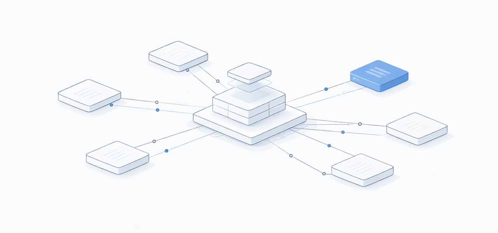
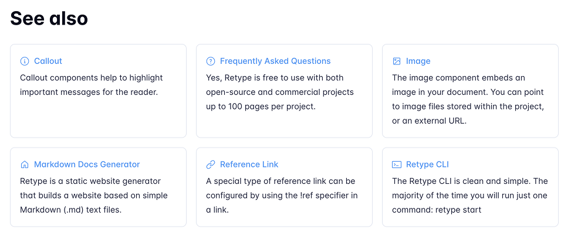
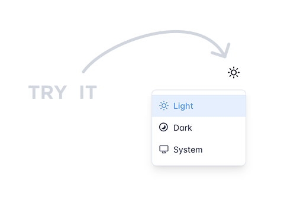

---
authors:
  - name: "@geoffreymcgill"
    email: geoff@retype.com
    link: https://github.com/retypeapp
category:
  - release
---
# What's New in Retype v3.12



Retype `v3.12` brings powerful new features for content discovery, visual design, and theme customization. This release introduces the [[Backlinks]] component for Retype Pro, automatic dark mode image switching, color preview chips, enhanced page descriptions, and comprehensive theming improvements.

See the full [[Changelog]] and [[Feature Log]] for a detailed list of updates in the `v3.12` release.

## New Backlinks Component

!!!
The Backlinks component is a Retype [!badge PRO](/pro/pro.md) component and requires a key.
!!!

Discover how your content connects with the new [[Backlinks]] component. This powerful feature automatically displays all inbound links to a page from other pages within your project, helping users discover related content and understand page relationships.

### Automatic Discovery

Backlinks appear automatically at the bottom of pages that have inbound links. **No configuration needed.** Retype leverages its existing dependency tracking infrastructure to build a web of interconnected content.



### Flexible Configuration

Configure backlinks at the [project](/configuration/project.md#backlinks) or [page](/configuration/page.md#backlinks) level:

```yaml retype.yml
# Project configuration
backlinks:
  enabled: true # or false to disable project-wide
  title: "Referenced by"
  maxResults: 10
```

```yaml sample-page.md
---
# Page-level override
backlinks:
  enabled: true
  title: "See also"
  maxResults: 5
---
# Sample page

This is a sample page.
```

### Manual Placement

By default, the backlinks are automatically added to the bottom of each page, but you can manually place the component anywhere in your content using the `[!backlinks]` Markdown component syntax.

```markdown
# My Page Content

Main content here...

[!backlinks]

Additional content after backlinks...
```

The Backlinks component creates natural pathways between related topics, improves content discovery, and helps authors see which pages reference their content.

## Automatic Dark Mode Image Switching

Retype now automatically detects and switches between light and dark image variants based on the active theme. Simply add another image file to your project with the same file name but with a `-dark` suffix and Retype handles everything else automatically.



### Zero Configuration

Drop your dark variant image files alongside the originals with a `-dark` suffix. No manual configuration required. For example, if you have an image named `sample.png`, create a dark mode version of the image named `sample-dark.png` and place it in the same directory.

If no dark variant exists, Retype uses the original image for both **light** and **dark** themes.

This feature extends to favicons too. Place a `favicon-dark.ico` or `favicon-dark.svg` alongside your standard favicon and Retype automatically switches based on the user's theme preference.

### Supported Formats

All standard image formats are supported, including `AVIF`, `BMP`, `GIF`, `HEIF`, `JPEG`, `JPG`, `PNG`, `SVG`, and `WebP`.

## Color Preview Chips

Hexadecimal [color codes](/components/color-chip.md) now display with automatic visual previews. When you reference a color in inline code, Retype adds a small circular preview showing the actual color.

Color: `#5495f1`

### Automatic Detection

Works with both 3-digit and 6-digit hex codes:

```markdown
The primary brand color is `#5495f1` and the accent is `#ff6b35`.

Short format also works: `#abc` or `#F00`.
```

The primary brand color is `#5495f1` and the accent is `#ff6b35`.

Short format also works: `#abc` or `#F00`.

## Enhanced Page Descriptions

Define page descriptions using the new triple-star (`***`) syntax blocks placed immediately following H1 headings. Descriptions render visually below the title and populate meta tags for SEO.

```markdown
# Page Title

***
This custom description appears below the page title.
***

Regular content starts here.
```

### Dual-Source Support

Use the [description](/configuration/page.md#description) page setting for meta tag value and `***` for page content:

```yaml
---
description: "SEO-optimized description for description meta tag"
---
# Page Title

***
A more detailed, visually formatted description with **emphasis** for readers.
***
```

### Content Restrictions

Descriptions support single paragraphs with limited inline formatting: bold, italic, inline code, strikethrough, and emojis. Links, images, and HTML tags are prohibited to ensure clean metadata.

## Expanded Heading Theme Variables

Comprehensive [theme](/configuration/theme-variables.md#heading) customization for headings `H1` through `H6`. Control border, margin, padding, color, weight, casing, and font size individually for each heading level.

```css
/* Individual heading customization */
--heading-h1-font-size: 2.5rem;
--heading-h1-margin-bottom: 2rem;
--heading-h1-border-top: var(--transparent);
--heading-h1: var(--heading-text);
--heading-h1-weight: var(--heading-weight);
--heading-h1-case: var(--heading-case);
```

Each heading level (H1-H6) has its own set of variables for precise control over typography and spacing.

---

## Write On!

Retype `v3.12` delivers powerful new capabilities for content discovery, visual design, and customization. The Backlinks component helps users navigate interconnected documentation. Automatic dark mode image switching ensures your visuals look great in any theme. Color preview chips bring design documentation to life. Enhanced page descriptions provide better SEO and visual appeal.

Try out the latest Retype release and experience these new features. Share your feedback with us on [X](https://x.com/retypeapp) or open a GitHub [Issue](https://github.com/retypeapp/retype/issues). Your input continues to shape the future of Retype.

