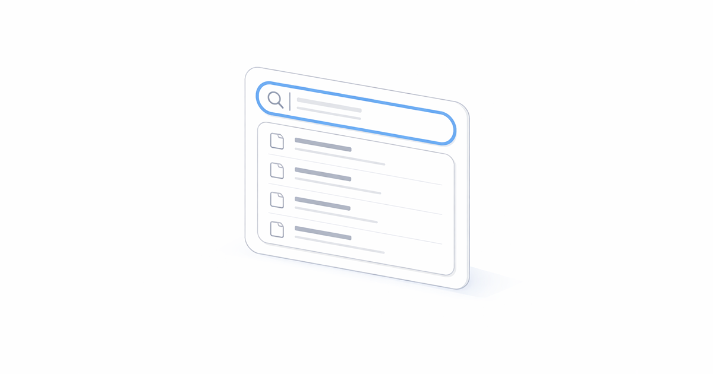
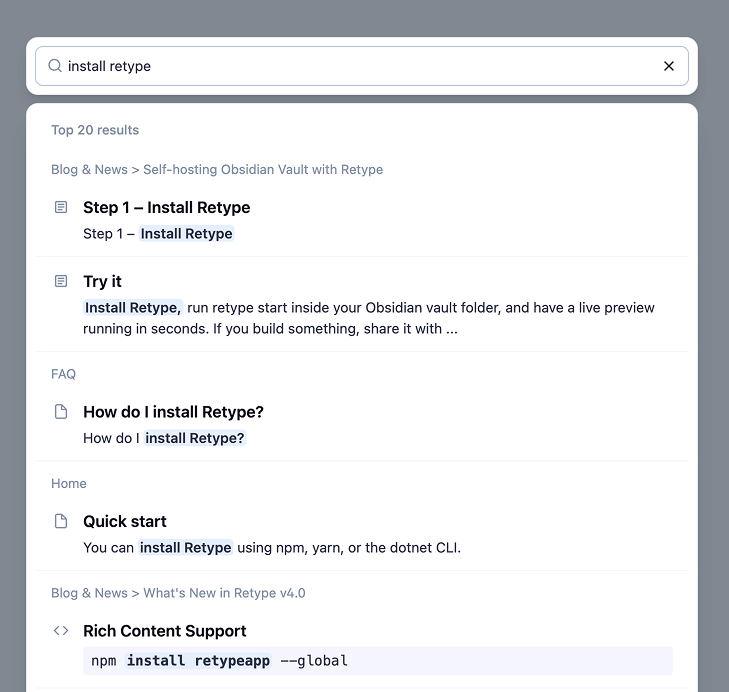
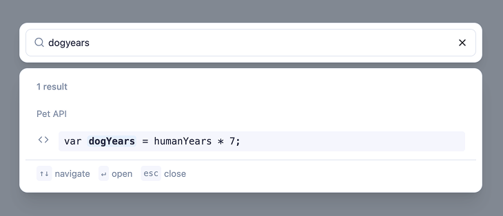

---
authors:
  - name: "@geoffreymcgill"
    email: geoff@retype.com
    link: https://github.com/retypeapp
category:
  - release
---
# What's New in Retype v4.1



Retype `v4.1` has been primarily a community-driven release shaped by suggestions and feedback from Retype users. A huge thank you to the Retype community for your contributions and ideas that made it into this release. This release delivers a completely redesigned search experience, Unicode icon support, and new blog layout options.

See the full [[Changelog]] and [[Feature Log]] for a detailed list of updates in the `v4.1` release.

## New Search Experience

Search in Retype `v4.1` has been rebuilt from the ground up. This release brings improvements to the search index process, search result quality, and a crispy fresh UI.



### Code Block Search

Code blocks are now included in the search index by default. When a result comes from a code block, Retype adds a :icon-code: icon beside code block search results.



Whether code blocks are included in the search results or not can be configured using the new `search.excludeCode` project configuration option. The following sample demonstrates excluding code blocks from the search index:

```yaml retype.yml
search:
  excludeCode: true  # default: false
```

Thank you [@gregdubiel](https://github.com/gregdubiel) in issue [#680](https://github.com/retypeapp/retype/discussions/680) for your feedback on the search experience that helped drive these improvements.

### Improved Ranking and Navigation

Search result ranking has been tuned to return more targeted results. As well, UI and keyboard navigation improvements make it faster to scan and jump to results without leaving the keyboard.

## Unicode Character Icons

Any single Unicode character can now be used as an icon on the `icon` frontmatter property and everywhere else that 
Emoji and Octicon icons are used.

```yaml page.md
---
icon: ✨
---

# Sample Page

[!button icon="✨" text="Sparkles"]
```

Use an emoji, a Dingbat, or any other Unicode character to give your pages a distinct visual identity in the navigation. The same syntax works on buttons, badges, and any other component that accepts an `icon` value.

[!button icon="✨" text="Sparkles"]

Thank you [@ApolonTorq](https://github.com/ApolonTorq) in issue [#785](https://github.com/retypeapp/retype/discussions/785) for the suggestion!

## Blog Improvements

### Default Blog Post Layout

A new `blog.layout` project setting lets you configure the default layout applied to all blog posts without needing to set the layout on every individual post.

For example, setting `blog.layout: page` instructs Retype to render every blog post using the `page` layout, which includes the left sidebar tree navigation and the right-side table of contents.

```yaml retype.yml
blog:
  layout: page
```

Any individual post can still override the default by setting `layout` in its own frontmatter. The project-level `blog.layout` simply sets the fallback when no page-level layout is defined.

### Blog Navigation Menu Item

The blog now automatically adds a menu item to the left sidebar tree navigation. The menu item links to your blog index and appears alongside your other navigation items without any manual configuration.

You can customize how the blog menu item is displayed by adding a `/blog/index.md` file to your project. The `icon`, `label`, and `order` frontmatter properties on that file control the appearance and position of the blog entry in the navigation:

```yaml blog/index.md
---
icon: ":newspaper:"
label: News & Views
order: 1000
---
```

This gives you full control over where the blog appears in the navigation and how it is labeled, without any special project-level configuration.

Thank you [@7MinSec](https://github.com/7MinSec) and  [@latenitefilms](https://github.com/latenitefilms) in issue [#729](https://github.com/retypeapp/retype/discussions/729) for the suggestion!

---

## Write On!

Retype `v4.1` sharpens the search experience with better results, richer indexing, and a cleaner UI. Unicode icon support opens up more expressive navigation. The new blog layout setting gives you more control over how your [blog](/guides/blogging.md) looks without per-page configuration.

[Install or upgrade](/guides/installation.md) Retype to try the latest release. Share your feedback on [X](https://x.com/retypeapp) or open a GitHub [Issue](https://github.com/retypeapp/retype/issues). Your input continues to shape the future of Retype.
