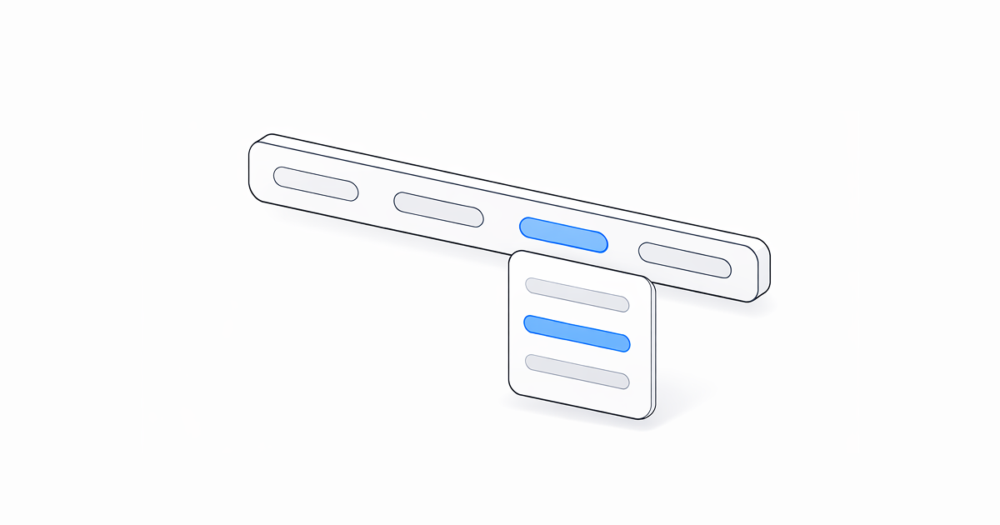
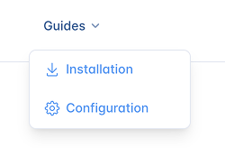
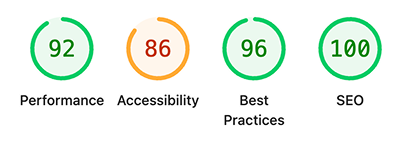

# What's New in Retype v4.3



Retype `v4.3` packs in notable new features and a solid round of enhancements. Header navigation now supports dropdown sub-menu support, backlinks gain fine-grained `include` and `exclude` controls, and date formatting is now fully configurable.

See the full [Changelog](/changelog.md#v430) and [Feature Log](/feature-log.md) for a detailed list of updates in the `v4.3` release.

---

## New header dropdown menus

-

Header [`links`](/configuration/project.md#links) now support nested `items` to create dropdown menus. 

Add a nested `items` list to any link within `links` and Retype renders a dropdown menu when the link is hovered.

```yaml
links:
  - text: Guides
    items:
      - text: Installation
        link: /guides/installation.md
        icon: download
      - text: Configuration
        link: /configuration/project.md
        icon: gear
```

Menus are supported to one level deep. Each item supports the same properties as a top-level link, including `text`, `link`, `icon`, `title`, and `description`. 

The dropdown menu width and horizontal offsets are customizable using the CSS [theme](/guides/themes.md) variables:

| Theme Variable | Description | Default | {.compact}
| --- | --- | --- |
| `header-links-dropdown-max-width` | Maximum width of the dropdown menu | `300px` |
| `header-links-dropdown-offset` | Horizontal offset of the dropdown menu | `0` |
| `header-links-dropdown-gap` | Vertical gap between the dropdown menu and the link | `0.5rem` |

On the retype.com website, we adjust the horizontal position of the menu using the following configuration:

```yml
theme:
  base:
    header-links-dropdown-offset: -1rem
```

---

## New backlinks include and exclude

The [backlinks](/configuration/page.md#backlinks) component now supports `backlinks.include` and `backlinks.exclude` settings to configure pages that should be explicitly included or excluded as backlinks in the **See also** sections across your project.

!!!
The Backlinks component, including `include` and `exclude` settings, requires a Retype [!badge PRO](/pro/pro.md) key.
!!!

The following section demonstrates how to exclude blog posts from appearing in the **See also** section of pages:

```yaml
backlinks:
  exclude:
    - /blog
```

This setting allows configuration using the same path-pattern rules as [`search.exclude`](/configuration/project.md#search-exclude). Excluded pages still render and are navigable, but they simply won't be added as backlinks on other pages.

Thank you to [@7MinSec](https://github.com/7MinSec) in issue [#809](https://github.com/retypeapp/retype/issues/809) for the feature request!

---

## New custom date format

A new [`dateFormat`](/configuration/project.md#locale-dateformat) setting in the [`locale`](/configuration/project.md#locale) project setting configures how dates are rendered across the site, including the date displayed as the published date and the [Last updated](/components/last-updated.md) date.

```yaml
locale:
  dateFormat: MM-dd-yyyy
```

A custom default date format can also be configured in [`labels`](/configuration/project.md#labels) using the `Default_DateFormat` key. The following sample demonstrates:

```yaml
labels:
  default:
    Default_DateFormat: MM-dd-yyyy
```

If `locale.dateFormat` is configured, it takes precedence over the `Default_DateFormat` label.

The date format settings can be configured with the following specifiers:

| Specifier | Meaning | Template sample | Output | {.compact}
| --- | --- | --- | --- |
| `yy` | Two-digit year | `dateFormat: yy` | 26 |
| `yyyy` | Four-digit year | `dateFormat: yyyy` | 2026 |
| `M` | Month number | `dateFormat: M` | 4 |
| `MM` | Two-digit month | `dateFormat: MM` | 04 |
| `MMM` | Abbreviated month name | `dateFormat: MMM` | Apr |
| `MMMM` | Full month name | `dateFormat: MMMM` | April |
| `d` | Day of month | `dateFormat: d` | 9 |
| `dd` | Two-digit day of month | `dateFormat: dd` | 09 |
| `ddd` | Abbreviated day name | `dateFormat: ddd` | Thu |
| `dddd` | Full day name | `dateFormat: dddd` | Thursday |

Common full date string configurations can be composed by combining individual specifiers:

| Template sample | Output | {.compact}
| --- | --- |
| `dateFormat: yyyy-MM-dd` | 2026-04-09 |
| `dateFormat: MM/dd/yyyy` | 04/09/2026 |
| `dateFormat: dd MMM yyyy` | 09 Apr 2026 |
| `dateFormat: MMM d, yyyy` | Apr 9, 2026 |
| `dateFormat: MMMM d, yyyy` | April 9, 2026 |
| `dateFormat: dddd, MMMM d, yyyy` | Thursday, April 9, 2026 |

The date format also respects the `locale` setting. For example, using the `locale: fr` configuration in your project will output French month and day names.

---

## New keyboard navigation

A new <kbd>gh</kbd> keyboard shortcut is short for **Go Home** and jumps you back to the home page of the website from any page within the website.

On your keyboard, just hit <kbd>g</kbd> then <kbd>h</kbd> to go back to the home page.

The <kbd>gh</kbd> shortcut extends the existing <kbd>[</kbd> and <kbd>]</kbd> keyboard shortcuts for navigation to the Next or Previous pages.

---

## Logo dimensions

Retype now auto-detects the dimensions of the `branding.logo` and `branding.logoDark` images and automatically adds the `width` and `height` attributes to the image.

When you need to set custom values for the logo dimensions, use the new [`branding.logoWidth`](/configuration/project.md#branding-logowidth) and [`branding.logoHeight`](/configuration/project.md#branding-logoheight) settings:

```yaml
branding:
  logo: ./logo.svg
  logoWidth: 150
  logoHeight: 31
```

The `alt` attribute of the logo is also now populated from [`meta.siteName`](/configuration/project.md#meta-sitename) setting.

---

## Other Enhancements

Retype `v4.3` also delivers a collection of polished upgrades and practical improvements.

Everything is listed in the [Changelog](/changelog.md#v430), but here are a few of the more notable upgrades:

[^1]: Footnotes are much nicer now!

Footnotes
: Footnotes[^1] have had a complete makeover in Retype `v4.3` and now have a much cleaner user-experience. Thank you for the community reports in issue [#676](https://github.com/retypeapp/retype/issues/676)!

Wikilink resolution
: Components now accept wikilinks as a valid `link` value. For example, configuring a Card component using `[!card vert]([[Mermaid]])` with the `[[Mermaid]]` wikilink as the path to the target page.

  [!card vert]([[Mermaid]])

Hyperlink style
: Links now render with an explicit [underline](/README.md) by default. Previously, link styling relied on color and weight alone, which reduced accessibility.

Heading permalinks
: The headings permalinks with a :icon-link: icon that appear when hovering have been improved and moved to the right side of the heading text.

Steps Permalink
: Step titles within the [Steps](/components/steps.md) component now show a permalink anchor on hover, matching the behavior of headings. This allows for deep linking to specific steps within a set of instructions.

Twitter meta tags
: Dedicated [Twitter/X](https://x.com/retypeapp) meta tags are now emitted alongside existing Open Graph tags. Sharing Retype-built pages to X will now render richer previews.

SEO improvements
: A number of important SEO improvements have been made in `v4.3`, including automatic image dimension detection, setting alt text, and improved handling of `aria` related attributes.

  The following Lighthouse report still shows some areas for improvement, but we're working on it!

  

Backlinks for all pages
: [[Backlinks]] are now enabled by default for all page layouts, including `blog` pages. Backlinks[Backlinks](/components/backlinks.md)led for individual pages or folders by configuring the [`backlinks.enabled`](/configuration/project.md#backlinks-enabled) project setting.

Folder-Level backlinks inheritance
: The `backlinks` setting is now configurable at the folder-level, to set `backlinks.enabled` for all child pages in that folder.
  ```yaml
  # blog/index.yml
  backlinks:
      enabled: false
  ```

Symlink hot-reloading
: Symlinked content files now trigger live-reload rebuilds when their target files change during `retype start`. 

---

## Write On!

Retype `v4.3` delivers header dropdowns for richer site navigation, granular backlinks controls for cleaner **See also** sections, and a set of focused enhancements across footnotes, heading anchors, keyboard shortcuts, and SEO.

[Install or upgrade](/guides/installation.md) Retype to try the latest release. Share your feedback on [X](https://x.com/retypeapp) or open a GitHub [Issue](https://github.com/retypeapp/retype/issues). Your input continues to shape the future of Retype.

---
