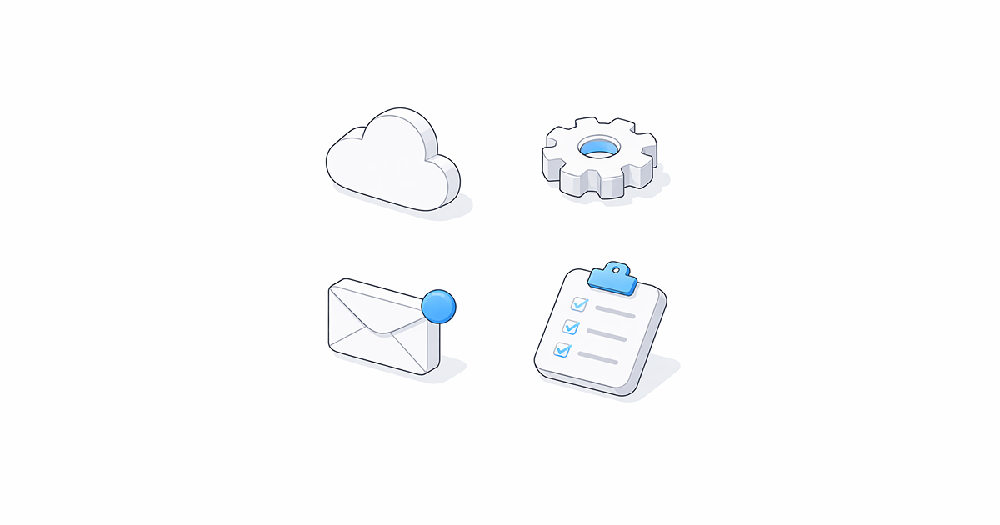
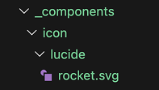
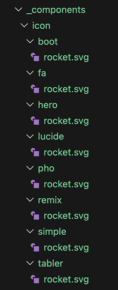

---
authors:
  - name: "@geoffreymcgill"
    email: geoff@retype.com
    link: https://github.com/retypeapp
category:
  - release
---
# What's New in Retype v4.4



Retype `v4.4` is another big release, including two new extensibility features that we have all wanted for a long time. The all new, **custom icons** deliver unlimited icon options for your project, and **advanced include selectors** let you share and reuse content and components across pages in powerful new ways. 

On top of that, this release adds accordion behavior to Panel groups, collapsible Callouts, a fallback path finder for images in shared folders, auto-expanding collapsed panels, and several nice bug fixes.

See the full [Changelog](https://retype.com/changelog/) and [Feature Log](https://retype.com/feature-log/) for a detailed list of updates in the `v4.4` release.

---

## Custom icons

Retype now supports custom icons, giving you full control to configure any SVG icon for use in your project. The built-in [[Octicons]] remain the default, but you can now add unlimited icons using the new `_components/icon/` extensibility point.

New icons are organized into "packs" and then referenced using the same familiar `icon` syntax across components and configs. For example, the following folder structure demonstrates where to organize icons from [Lucide](https://lucide.dev/):

```
_components/
  icon/
    lucide/
```

Then add `.svg` icon files into the `_components/icon/lucide` folder which immediately become available for use in your project. 

-

To add a Lucide `rocket` icon, download the [`rocket.svg`](https://lucide.dev/icons/rocket) file and save it to `_components/icon/lucide/rocket.svg`. 

Your folders structure should look like the following:

```
_components/
  icon/
    lucide/
      rocket.svg
```

You can now immediately use the `:icon-lucide-rocket:` :icon-lucide-rocket: icon shortcode anywhere in your project. No other configuration or setup is required.

```md
:icon-lucide-rocket:
```

or set as the `icon` for a page:

```md
---
icon: lucide-rocket
---
# Sample Page

This is a sample page.
```

The new icon can also be used in components like [!button icon="lucide-rocket" text="Button"](/components/button.md) by setting the `icon` property:

```
[!button icon="lucide-rocket" text="Button"]
```

Custom icon packs are automatically discovered from `_components/icon/` at build time. Each subfolder represents an icon pack, and each `.svg` file within the directory becomes an icon. The pack name comes from the folder name, and the icon name is derived from the `.svg` file name.

!!!
Only `.svg` files are supported at this time.
!!!

Unlimited `.svg` icons can be added to your project, each pack can have any number of icons, and you can organize your icons in any way that best works for your project or requirements.

Here a few popular icon packs to get you started:

Icons | Count (March 2026) | Shortcode | Sample
--- | --- | --- | ---
[Octicons](/components/octicons.md) (default) | 371 | `:icon-rocket:` | :icon-rocket:
[Bootstrap](https://icons.getbootstrap.com/) | >2000 | `:icon-boot-rocket:` | :icon-boot-rocket:
[Font Awesome](https://fontawesome.com/) | >2000 | `:icon-fa-rocket:` | :icon-fa-rocket:
[Hero](https://heroicons.com/) | 316 | `:icon-hero-rocket:` | :icon-hero-rocket:
[Lucide](https://lucide.dev/) | 1685 | `:icon-lucide-rocket:` | :icon-lucide-rocket:
[Phosphor](https://phosphoricons.com/) | 9072 | `:icon-pho-rocket:` | :icon-pho-rocket:
[Remix](https://remixicon.com/) | 3229 | `:icon-remix-rocket:` | :icon-remix-rocket:
[Simple](https://simpleicons.org/) | 3414 | `:icon-simple-rocket:` | :icon-simple-rocket:
[Tabler](https://tabler.io/icons) | 6074 | `:icon-tabler-rocket:` | :icon-tabler-rocket:

For the `rocket` samples above, the icon files are organized into the following folder structure:



The icon folder names do not need to match the icon pack name. The icon file names are also customizable and can use any labeling system you prefer, although obviously using a descriptive file name is recommended.

You could also create a custom icon pack for your project or brand by using your own `.svg` files or mix-and-match `.svg` files from different icon packs. Just add your icon files into a `_components/icon/<pack-name>/` folder, then start using.

---

## Advanced include selectors

The  partial system now resolves a wider range of content targets beyond named regions. Existing region-based includes are unchanged, and selector resolution only expands what happens when a region match is not found.

Resolution follows a defined precedence order:

1. Named region (`///region id ... ///endregion`)
2. Heading anchor
3. Component or block with a matching identifier
4. Other individually identifiable node

That ordering preserves compatibility for existing region workflows while unlocking several new selector-based include patterns.

### Named region include

Existing named-region includes still work exactly as before.



### Heading section include

A heading selector matches either the normalized heading text as an `id` or an explicit heading anchor and includes the matched heading plus all nested content until the next heading at the same or higher level, or until reaching the end of the document.

``` other-page.md
## Onboarding Flow

Install the CLI first.

### Step 1

Confirm the command is available.
```



The  above will grab the `## Onboarding Flow` heading and all its nested content from `other-page.md`, then add that block of content into `my-page.md`.

### Component include

Components can be picked from other files by referencing their `id` value. The following Callout will have an `id` value of `my-callout` by default:

```md other-page.md
!!! My Callout
This is a callout.
!!!
```

!!! My Callout
This is a callout.
!!!

That same Callout can be picked out and included in more pages by using `#my-callout` as the selector:



{{ include "#my-callout" }}

### Single node include

Individual components with an `id` configured can be selected and included in other pages:

```md other-page.md
[!button Start Trial](/pro/){#trial-button}
```



---

## Accordion mode for Panel groups

Panel groups now support a true accordion behavior. When all panels in a group are collapsed, or all but one, expanding any panel collapses the rest automatically. Only one panel stays open at a time.

To create an accordion, write your panels as you normally would with collapsed syntax:

```md
==- What is Retype?
Retype is a documentation generator that builds beautiful websites from Markdown files.

==- How do I get started?
Install the Retype CLI and run `retype init` in your project directory.

==- Where can I deploy?
Retype sites deploy to GitHub Pages, Netlify, Vercel, or any static host.
===
```

==- What is Retype?
Retype is a documentation generator that builds beautiful websites from Markdown files.

==- How do I get started?
Install the Retype CLI and run `retype init` in your project directory.

==- Where can I deploy?
Retype sites deploy to GitHub Pages, Netlify, Vercel, or any static host.
===

One panel can be pre-expanded to serve as the default open item. The accordion behavior kicks in automatically based on the initial state of the group.

---

## Collapsible Callout component

[Callouts](/components/callout.md) now support expand and collapse. Start your Callout component with `!!-` to create a collapsed Callout.

```md
!!- Click to expand
This Callout starts collapsed.
!!!
```

!!- Click to expand
This Callout starts collapsed.
!!!

The expand and collapse toggle works the same as the [Panel](/components/panel.md) component, with the arrow button on the right of the header and a clickable title.

---

## Fallback path finder for images

When a local image link cannot be resolved from the path as written, Retype now searches a set of well-known project folders before treating the image as missing.

This is useful when a project maintains shared media in a central location like `/static` or `/attachments`, and allows content authors to use short paths:

```md

```

If `sample.png` is not found relative to the current page, Retype searches the following folders in order:

- `/static`
- `/images`
- `/img`
- `/resources`
- `/attachments`
- `/assets`
- `/public`

The first match wins.

---

## Other Enhancements

Anchor links reveal collapsed content
: Links to anchors inside collapsed panels now expand those panels automatically. If the target is inside an inactive tab, Retype switches to that tab. See [#816](https://github.com/retypeapp/retype/issues/816).

Improved Component IDs
: Retype components and definition lists now get unique `id` values assigned automatically which will help with direct linking. Retype also emits a build warning when duplicate `id` values are detected on the same page. See [#815](https://github.com/retypeapp/retype/issues/815).

Obsidian nested heading links
: Add support for Wikilinks using multiple `#` anchor segments to target nested headings to now resolve correctly, such as `[[Settings#General#Account]]`.

Auto-detect branding logo
: If [`branding.logo`](/configuration/project.md#branding-logo) is not configured, Retype now automatically searches for a `logo` image file in well-known resource directories such as `/assets`, `/static`, and `/images`. The first match is used as the project logo without any additional configuration.

Panel content truncation
: The Panel component no longer truncates content. Previously, the Panel height was pre-calculated based on an initial content state and might not correctly calculate if images or other component were within the Panel body. See [#813](https://github.com/retypeapp/retype/issues/813).

---

## Write On!

Retype `v4.4` is one of the most extensibility-focused releases yet. Custom icon packs open up unlimited icon options by letting you bring any SVG file directly into your project. Expanded include selectors turn your content into reusable building blocks, letting you pull headings, components, and individual nodes from one page into another. Together, these two features give you significantly more control over the look and structure of your documentation. Accordion panels, collapsible Callouts, and the fallback image path finder round out a release.

[Install or upgrade](https://retype.com/guides/installation/) Retype to try the latest release. Share your feedback on [X](https://x.com/retypeapp) or open a GitHub [Issue](https://github.com/retypeapp/retype/issues). Your input continues to shape the future of Retype.
