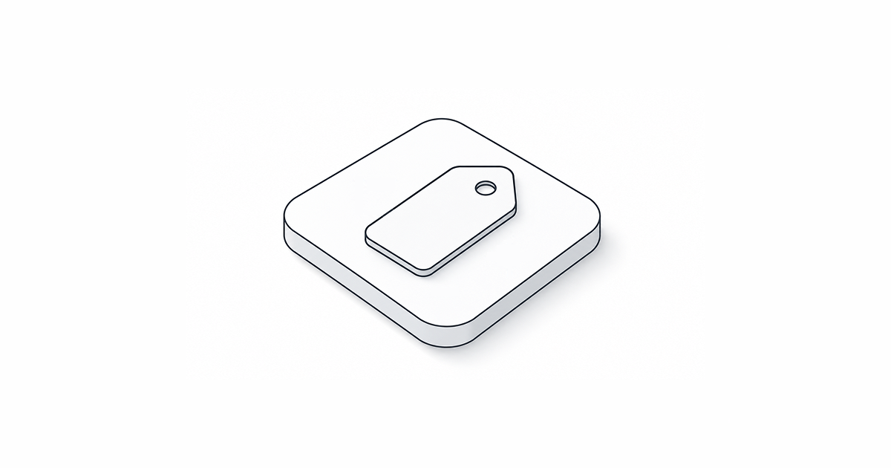
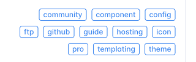
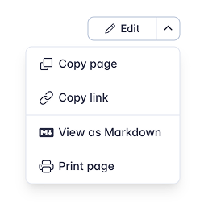

# What's New in Retype v4.5



Documentation that sits still isn't working hard enough. Retype `v4.5` delivers readers more ways to navigate, share, and act on content, and makes every page ready for AI tools right out of the box.

This release introduces the new **Tags in the left menu** feature, plus automatic `llms.txt` generation, sanitized Markdown output, Page Actions, new Card layouts, new Table styles, Instagram and Google Maps embeds, and `sitemap.xml` generation.

See the full [Changelog](/changelog.md#v450) and [Feature Log](/feature-log.md#v450) for a detailed list of updates in the `v4.5` release.

---

## Tags in the left menu

Retype can now automatically add a tag summary section to the left sidebar navigation.



The new [`nav.tags`](/configuration/project.md#nav-tags) feature collects the [`tags`](/configuration/page.md#tags) used across your pages and renders them into the bottom of the left navigation, giving readers a quick way to navigate by topics.

```yml
nav:
  tags:
    enabled: true
    title: Topics
    limit: 12
```

Pages already support `tags` in frontmatter:

```md
---
tags: [guides, deployment, github]
---
# Deploy to GitHub Pages
```

With `nav.tags` enabled, Retype builds the sidebar tag list from those page tags automatically. The feature can also be tuned with include and exclude filters, a display limit, layout options, alignment, ordering, and badge variant.

```yml
nav:
  tags:
    enabled: true
    title: Popular topics
    layout: stack
    align: left
    order: count
    variant: info
    include:
      - guides
      - reference
      - deployment
    exclude:
      - draft-*
```

This is especially useful for larger projects where the left navigation is organized by folder, but readers also need another path into the content by product area, role, feature, or workflow.

---

## llms.txt support

Retype now automatically generates a clean [`llms.txt`](/llms.txt) file for AI-friendly documentation discovery.

An `llms.txt` file gives AI systems a concise map of the most important pages in your project, with links to Markdown-friendly versions of those pages. It is designed for documentation consumption, not visual browsing, so tools can quickly understand where the homepage, installation guide, configuration reference, components, templating docs, hosting guides, and other important resources live.

For example, the [`llms.txt`](/llms.txt) file can point tools toward Markdown URLs such as:

```txt
- [Installation](https://retype.com/guides/installation.md): Install Retype using npm, Yarn, or dotnet.
- [Project Configuration](https://retype.com/configuration/project.md): Site-wide settings in retype.yml.
- [Components](https://retype.com/components/components.md): Full index of built-in authoring components.
```

This pairs nicely with the new generated Markdown output in `v4.5`, giving both humans and automated systems another option for consuming content.

!!!tip
Authors can use the generated **llms.txt** file as a starting point to create their own custom **llms.txt** file. Save your custom **llms.txt** into the root of your project and Retype will use that file instead of automatically generating one.
!!!

---

## Markdown pages

Every generated page now includes a sanitized `.md` source file alongside the `.html` output.

That means a page such as [`/guides/installation/`](/guides/installation.md) are also published as <a href="/guides/installation.md"><code>/guides/installation.md</code></a>.

Just add the `.md` extension to any page url to see the `.md` version of the content.

The generated Markdown is cleaned for downstream use and exposed in the HTML page metadata with a `rel="alternate"` link tag, making it easier for external tools to discover the Markdown version of the current page.

Retype also adds a new `{{ page.md }}` template property for linking to the generated Markdown file from templates, components, menus, and custom UI.

```md
[!button text="View Markdown"]({{ page.md }})
```

[!button text="View Markdown"](https://retype.com/blog/2026-04-07-whats-new-in-retype-v450.md)

This new functionality opens the door for smoother copy, export, and AI-assisted workflows. Readers can stay on the rendered page when they want the full website experience, or jump to the Markdown version when they need a clean source representation.

---

## Page Actions

Retype `v4.5` introduces [Actions](/configuration/actions.md) plugins for menus and links, plus a new Page Action button that can appear on every page.

Actions let you attach common behavior to UI items using an `action` value instead of hardcoding a URL. Built-in actions include copying the current page link, copying the page Markdown, viewing the Markdown source, opening print, and opening the current page in AI tools.



The `actions.items` configuration controls the page action menu:

```yml
actions:
  items:
    - text: Copy page
      action: copy-page-markdown
      icon: copy
    - text: Copy link
      action: copy-page-link
      icon: link
    - type: separator
    - text: View as Markdown
      action: view-page-markdown
      icon: markdown
    - text: Print page
      action: print-page
      icon: brand-printer
```

Menu item separators are configured using `type: separator`, making longer menus easier to scan and provide visual grouping.

The same action system can be used by other linkable UI, including buttons and menu items. This gives project authors a consistent way to expose page-level utilities without building custom JavaScript for every workflow.

---

## New Card layouts

The [Card](/components/card.md) component now includes two new layouts: [`signal`](/components/card.md#signal) and [`snap`](/components/card.md#snap).

### Signal cards

Use [`signal`](/components/card.md#signal) for compact navigation rows. They work well for homepages, intros, quick-start sections, and any page that needs a clean list of important next steps.

```md
[!card signal](/guides/installation.md)
[!card signal](/guides/getting-started.md)
```

[!card signal](/guides/installation.md)
[!card signal](/guides/getting-started.md)

Signal cards can resolve the title and icon from local page metadata, and they support custom `title`, `text`, `kicker`, and `icon` values.

### Snap cards

Use [`snap`](/components/card.md#snap) for tile-style cards with a prominent icon or image. Snap cards are a good fit for app pickers, integration lists, tool directories, or compact launch surfaces.

```md
[!card snap](/guides/installation.md)
[!card snap](/guides/getting-started.md)
```

[!card snap](/guides/installation.md)
[!card snap](/guides/getting-started.md)

For local pages, `snap` can auto-resolve the icon from page metadata and fall back to the page image when no icon is configured.

---

## New Table styles

Tables now support `clean`, `striped`, and `equal` styles for clearer comparisons and denser reference content.

Use [`clean`](/components/table.md#clean) to remove borders:

```md
{.clean}
Project              | Status                     | Owner
---                  | ---                        | ---
Website Redesign     | [!badge Review]            | Operations
Quarterly Forecast   | [!badge Approved|success]  | Finance
Customer Onboarding  | [!badge Draft|secondary]   | Product
```

{.clean}
Project              | Status                     | Owner
---                  | ---                        | ---
Website Redesign     | [!badge Review]            | Operations
Quarterly Forecast   | [!badge Approved|success]  | Finance
Customer Onboarding  | [!badge Draft|secondary]   | Product

Use [`striped`](/components/table.md#striped) to alternate row backgrounds:

```md
{.striped}
Project              | Status                     | Owner
---                  | ---                        | ---
Website Redesign     | [!badge Review]            | Operations
Quarterly Forecast   | [!badge Approved|success]  | Finance
Customer Onboarding  | [!badge Draft|secondary]   | Product
```

{.striped}
Project              | Status                     | Owner
---                  | ---                        | ---
Website Redesign     | [!badge Review]            | Operations
Quarterly Forecast   | [!badge Approved|success]  | Finance
Customer Onboarding  | [!badge Draft|secondary]   | Product

Use [`equal`](/components/table.md#equal) when you want column widths distributed evenly across the table:

```md
{.equal}
Feature              | Free                       | Pro
---                  | ---                        | ---
Search               | [!badge Included|success]  | [!badge Included|success]
Navigation tags      | [!badge No|secondary]      | [!badge Yes|success]
Custom themes        | [!badge No|secondary]      | [!badge Yes|success]
```

{.equal}
Feature              | Free                       | Pro
---                  | ---                        | ---
Search               | [!badge Included|success]  | [!badge Included|success]
Navigation tags      | [!badge No|secondary]      | [!badge Yes|success]
Custom themes        | [!badge No|secondary]      | [!badge Yes|success]

These styles can be [combined](/components/table.md#clean-3) together and also used with `compact` when you need concise reference tables that still read clearly.

```md
{.clean .striped .equal .compact}
Feature              | Free                       | Pro
---                  | ---                        | ---
Search               | [!badge Included|success]  | [!badge Included|success]
Navigation tags      | [!badge No|secondary]      | [!badge Yes|success]
Custom themes        | [!badge No|secondary]      | [!badge Yes|success]
```

{.clean .striped .equal .compact}
Feature              | Free                       | Pro
---                  | ---                        | ---
Search               | [!badge Included|success]  | [!badge Included|success]
Navigation tags      | [!badge No|secondary]      | [!badge Yes|success]
Custom themes        | [!badge No|secondary]      | [!badge Yes|success]

---

## Instagram and Google Maps embeds

Retype now includes first-class support for **Instagram** and **Google Maps** embeds.

### Instagram

Paste a standalone [Instagram](/components/instagram.md) post or Reel URL on its own line and Retype converts it into an embedded post.

```md
https://www.instagram.com/reel/DLHx_WNoXoY/
```

https://www.instagram.com/reel/DLHx_WNoXoY/

Both `/p/` post URLs and `/reel/` URLs are supported, with or without the `www.` prefix.

### Google Maps

Paste a [Google Maps](/components/google-maps.md) embed URL on its own line and Retype renders a responsive map embed.

```md
https://www.google.com/maps/embed?pb=...
```

https://www.google.com/maps/embed?pb=!1m18!1m12!1m3!1d198778.33914254082!2d103.70358128993288!3d1.3237428276302825!2m3!1f0!2f0!3f0!3m2!1i1024!2i768!4f13.1!3m3!1m2!1s0x31da11238a8b9375%3A0x887869cf52abf5c4!2sSingapore!5e0!3m2!1sen!2sca!4v1775257132373!5m2!1sen!2sca

You can also paste the `<iframe>` snippet generated by Google Maps' **Share -> Embed a map** option, and Retype will normalize it into the same responsive embed component.

Only Google Maps `maps/embed` URLs trigger the auto-embed behavior. Regular place pages and short share links remain normal hyperlinks.

---

## Other Enhancements

Retype `v4.5` also includes a set of focused improvements across HTML output, navigation behavior, and page ergonomics.

CommonMark HTML compliance
: Retype now produces HTML output that is fully aligned with the CommonMark spec, including tidier output for Markdown lists that contain block elements.

Backlinks performance
: Backlinks generation and page output have been optimized, which should help larger projects with many cross-page links build more efficiently.

Permalink behavior
: Page primary H1 headings no longer render a permalink. Other heading permalinks now use a button style, and clicking a permalink automatically copies the link to the clipboard.

Table of contents shortcut
: Clicking the table of contents column title now scrolls the page back to the top.

---

## Write On!

Retype `v4.5` brings together several pieces that make documentation sites easier to discover, easier to reuse, and easier to act on. Navigation tags give readers a new path through large projects, `llms.txt` and generated Markdown output make docs more useful for AI-assisted workflows, and page actions put copy, print, source, and external tool handoffs within reach.

The new Card layouts, table styles, embeds, and sitemap generation round out a release focused on practical polish for real documentation projects.

[Install or upgrade](/guides/installation.md) Retype to try the latest release. Share your feedback on [X](https://x.com/retypeapp) or open a GitHub [Issue](https://github.com/retypeapp/retype/issues). Your input continues to shape the future of Retype.
