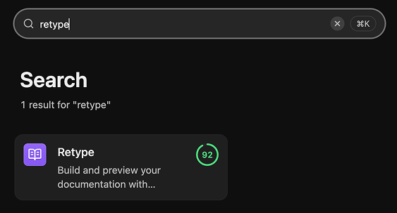
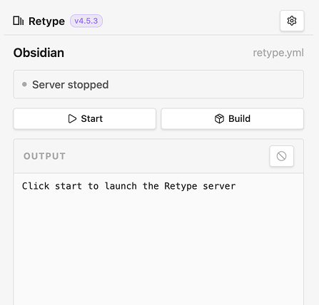
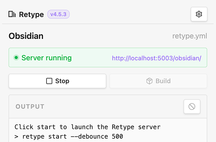

# Retype for Obsidian

[Obsidian](https://obsidian.md/) is where a lot of great documentation starts. [Retype](https://retype.com/) is how that Markdown becomes a fast, polished, self-hosted website. Now Retype is available directly inside Obsidian.

{.callout}
> Write in Obsidian. Preview with Retype. Publish anywhere.

The official Retype plugin is available in the [Obsidian Community plugin directory](https://community.obsidian.md/plugins/retype). Install Retype directly from Obsidian, and manage your Retype projects from inside your vault.

**Retype for Obsidian** is available on macOS, Windows, and Linux.

---

See the full [Obsidian Plugin](/guides/obsidian-plugin.md) guide for detailed installation instructions:

[!card layout="signal" icon="brand-obsidian"](/guides/obsidian-plugin.md)

---

## Build from where you write

Obsidian is already a natural home for Markdown docs, knowledge bases, internal notes, product documentation, and digital gardens. Retype turns that same Markdown into a professional documentation website. The **Retype for Obsidian** plugin removes the friction between the two by bringing Retype controls directly into Obsidian.

No terminal required for the common loop of ***start***, preview, **stop**, and **build**. Your vault stays your vault, your Markdown stays portable with no platform dependencies, and Retype handles the site generation.

!!!tip
If your docs already live in Obsidian, Retype can turn that same vault into a website without changing how you write.
!!!

---

## See it in action

Install the plugin, open the Retype panel from the sidebar, and your site controls are right there alongside your content.

Start the Retype development server and the panel updates in real time. The local URL becomes a clickable link, and CLI output streams into the **output** panel below.

If you have not yet installed the Retype CLI, the panel detects that automatically and offers a one-click install without leaving Obsidian.

For a full walkthrough of the install process, panel controls, settings, and CLI detection, see the [Obsidian Plugin guide](/guides/obsidian-plugin.md).

---

## Open source and ready for feedback

Retype for Obsidian is the official Retype plugin, published under the [Apache-2.0 license](https://github.com/retypeapp/retype-for-obsidian/blob/main/LICENSE).

The source is on GitHub at [retypeapp/retype-for-obsidian](https://github.com/retypeapp/retype-for-obsidian). Issues, ideas, and pull requests are all welcome. If you build something with it, share it with us on [X](https://x.com/retypeapp) or in the [Obsidian community](https://community.obsidian.md/).

---

## Try it today

- [Install Retype for Obsidian](https://community.obsidian.md/plugins/retype)
- [Obsidian Plugin guide](/guides/obsidian-plugin.md)
- [View source on GitHub](https://github.com/retypeapp/retype-for-obsidian)
- [Self-hosting your Obsidian vault with Retype](/blog/2026-02-25-self-hosting-obsidian-vault-with-retype.md)

---
