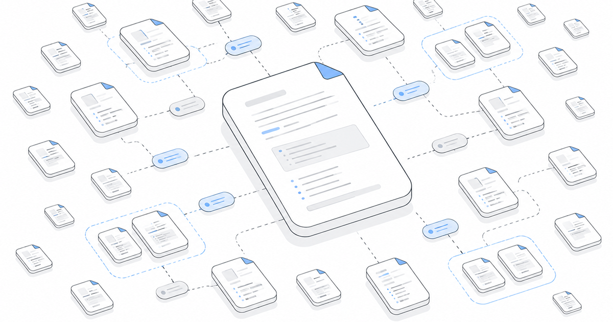

---
authors:
  - name: "@geoffreymcgill"
    email: geoff@retype.com
    link: https://github.com/retypeapp
category:
  - release
---
# What's New in Retype v4.6



Retype v4.6 is a big release for growing documentation projects.

This release removes the page limit for Retype Free, introduces partial project configuration files, adds a Table Copy button, extends [[Card]] components with `target` support, makes `[!file]` downloads smarter, and ships one of the largest performance passes in recent releases.

See the full [Changelog](/changelog.md#v460) and [Feature Log](/feature-log.md#v460) for a detailed list of updates in the `v4.6` release.

---

## Unlimited pages for Retype Free

The free version of Retype now supports unlimited pages.

Previously, free projects had a page limit that could hold back growing projects. Starting in v4.6, that limit is gone. All projects can keep building without hitting a ceiling.

[!button text="Installation Guide" icon="download"](/guides/installation.md)

[Retype Pro](/pro/pro.md) still exists with Pro-tier features, but page count is no longer a constraint for any project using Retype. If you have been holding back on expanding your project, now is a good time to upgrade to v4.6 and keep building.

This is a meaningful change for the community as Retype is always free and stays flexible as your page count grows.

---

## Retype Pro now includes 3 projects

Starting in v4.6, every [Retype Pro](/pro/pro.md) license now includes 3 projects. Previously, a Pro license only included one project.

This makes Pro a stronger fit for teams and builders who manage more than one site. Agencies handling client documentation get more flexibility without stacking separate licenses up front. Teams maintaining separate product docs, an internal knowledge base, and a help center can cover all three under one Pro license. Builders running sandbox, staging, and production environments get the full Pro experience across all three.

The extra capacity is built in. No add-ons required.

If you have been considering Pro, the expanded project count is a good reason to take a closer look. Custom themes, private pages, breadcrumb navigation, and branding removal are all included across every project in your license.

[!button text="See Retype Pro" icon="verified"](/pro/pro.md)

---

## Project Partials

Retype projects can now be configured from partial `.yml` project files using the new [`extends`](/configuration/project-partials.md) setting and other command specific configuration files.

[!card](/configuration/project-partials.md)

A single `retype.yml` works great for small projects, but as projects grow it becomes useful to share a base config across multiple sites, separate a theme from project-specific settings, or use different config values for local preview versus production builds.

```yml
# retype.yml
extends:
  - ./config/retype.base.yml
  - ./config/theme.acme.yml

input: ./docs
output: ./.retype
url: docs.example.com
```

The main `retype.yml` file is merged first. Files listed in `extends` are then merged over it, so extended files can override values from `retype.yml`.

```yml
# config/theme.acme.yml
branding:
  logo: ./assets/acme-logo.svg
  label: Acme Docs

theme:
  base:
    color: '#172033'
    background: '#ffffff'
  primary:
    color: '#007acc'
```

Command-specific project files make it easy to separate local behavior from production build settings:

```yml
# retype.start.yml
serve:
  watch:
    mode: memory

start:
  open: true
```

```yml
# retype.build.yml
url: docs.example.com

lastUpdated:
  date:
    enabled: true
```

1. `retype.yml` remains the main project file. 

2. `retype.start.yml` applies only during [`retype start`](/guides/cli.md#retype-start).

3. `retype.build.yml` applies only during [`retype build`](/guides/cli.md#retype-build). 

4. Command-specific files are merged after `retype.yml` and `extends`, so they can override earlier values.

5. CLI arguments still win over everything.

No config language. No custom scripts. Just layered Retype config.

---

## Copy Table as Markdown

[Table](/components/table.md) components now get a :icon-copy: copy button on hover, similar to code blocks.

Hover a table and Retype shows a copy button in the top-right corner. Clicking the copy button copies a clean Markdown version of the table into your clipboard.

Project              | Status                    | Owner
---                  | ---                       | ---
Website Redesign     | [!badge Review]           | Operations
Quarterly Forecast   | [!badge Approved|success] | Finance
Customer Onboarding  | [!badge Draft|secondary]  | Product

```md
Project              | Status                    | Owner
---                  | ---                       | ---
Website Redesign     | [!badge Review]           | Operations
Quarterly Forecast   | [!badge Approved|success] | Finance
Customer Onboarding  | [!badge Draft|secondary]  | Product
```

This pairs well with recently added [Markdown output](/blog/2026-04-07-whats-new-in-retype-v450.md#markdown-pages) and is especially useful for docs with specs, comparison tables, and reference data that readers want to pull into their own workflows or prompts.

---

## Table column styling

Authors can now assign a CSS class to a Markdown table column header and have Retype apply that class to every cell in the column.

```md
Name   | Long Message {.whitespace-nowrap}                               | Description
---    | ---                                                             | ---
Item 1 | This is an extra long message that should not wrap in the table | This is a description
Item 2 | Another long content item                                       | Another description
Item 3 | A third example with similarly long content on one line         | A final description
```

Name   | Long Message {.whitespace-nowrap}                               | Description
---    | ---                                                             | ---
Item 1 | This is an extra long message that should not wrap in the table | This is a description
Item 2 | Another long content item                                       | Another description
Item 3 | A third example with similarly long content on one line         | A final description

The `.whitespace-nowrap` class is applied down the entire column, so every cell inherits it. This is especially helpful for reference tables containing IDs, command names, version strings, and other values that should not wrap lines.

Another useful scenario is applying a specific background style to a column to highlight the content. The following sample demonstrates one possible scenario:

```md
Project              | Status {style="background-color: var(--gray-100);"} | Owner
---                  | ---                                                                                                 | ---
Website Redesign     | [!badge Review]                                                                                     | Operations
Quarterly Forecast   | [!badge Approved|success]                                                                            | Finance
Customer Onboarding  | [!badge Draft|secondary]                                                                             | Product
```

Project              | Status {style="background-color: var(--gray-100); color: var(--base-text-strong); font-weight: 600;"} | Owner
---                  | ---                                                                                                 | ---
Website Redesign     | [!badge Review]                                                                                     | Operations
Quarterly Forecast   | [!badge Approved|success]                                                                            | Finance
Customer Onboarding  | [!badge Draft|secondary]                                                                             | Product


This new functionality also works well alongside the [recently](/blog/2026-04-07-whats-new-in-retype-v450.md#new-table-styles) added [table](/components/table.md) styles, including `.clean`, `.striped`, `.equal`, and `.compact`.

---

## New Card `target` property

[[Card]] components now support a `target` property, matching the behavior of [[Button]] and [[Badge]] components.

Cards are often used as integration links, entry points, and navigation tiles. Authors can now control whether a Card link opens in the same tab or a new one.

```md
[!card target="blank" title="Retype for Obsidian" icon="brand-obsidian" layout="signal"](https://github.com/retypeapp/retype-for-obsidian)
```

[!card target="blank" title="Retype for Obsidian" icon="brand-obsidian" layout="signal"](https://github.com/retypeapp/retype-for-obsidian)

Setting `target="blank"` opens the card link in a new tab. Behavior is unchanged when `target` is omitted. The property works across all Card layouts, including [`signal`](/components/card.md#signal) and [`snap`](/components/card.md#snap).

```md
[!card signal title="Retype docs" target="blank"](https://retype.com)
[!card snap title="GitHub repository" icon="mark-github" target="blank"](https://github.com/retypeapp/retype)
```

---

## Smarter `[!file]` downloads

Files explicitly referenced by [`[!file]`](/components/file-download.md) download component are now copied to output when they live inside the project input tree, even if that file type is not otherwise included by the project configuration.

```md
[!file sample.rb](/gem/config/sample.rb)
```

Before v4.6, a linked file with an uncommon extension could require an explicit [`include`](/configuration/project.md#include) rule before Retype would copy it to output. Now the `[!file]` reference itself is enough.

```yml
# No longer required for this exact [!file] download
include:
  - /gem/config/sample.rb
```

This makes `[!file]` behave more like explicit author intent: if you add a file download component, Retype makes that download work. This applies to the exact file referenced and respects the project input boundary.

---

## Faster builds and watch updates

Retype v4.6 includes one of the largest performance-focused passes we have shipped in recent releases.

This work touches page rendering, resource deployment, template parsing, backlinks, discovery, Markdown processing, and watch-mode rebuild behavior. The cumulative effect is faster large project builds, better watch-mode responsiveness during local preview, less repeated parsing across builds, more bounded concurrency in safe places, and better internal caching throughout.

You should feel this most on larger sites and frequent local preview workflows.

---

## Header title typography controls

New [Header](/configuration/theme-variables.md#header) theme options let projects tune the main site title typography without custom CSS.

This is useful for projects with long product names, nested docs brands, or localized site titles that need tighter rendering.

```yml
theme:
  base:
    header-title-font-size: 1rem
    header-title-font-size-md: 1rem
```

Existing sites keep the same defaults. Projects that need tighter title rendering can opt in through [theme](/guides/themes.md) config.

<!-- Screenshot idea: before/after header with a long site title wrapping before v4.6 and fitting cleanly after applying the new theme option. -->

The following Header theme variables have been added:

```yml
header-title-font-size
header-title-font-size-md
header-title-font-weight
header-title-line-height
header-title-line-height-md
```

---

## Better defaults and polish

Retype v4.6 also includes a set of focused improvements to defaults and UI behavior.

Last updated default
: `lastUpdated.date.enabled` now defaults to `false` for better build performance. Enable it explicitly if your project should show git-based last updated dates. Projects relying on the previous default will want to add this to `retype.yml` or `retype.build.yml` to restore the behavior.

  ```yml
  lastUpdated:
    date:
      enabled: true
  ```

Cleaner copy feedback
: Code blocks now use a checkmark confirmation state after copying, replacing the previous "Copied!" tooltip text. This matches the cleaner button behavior used elsewhere in Retype.

  ```js
  console.log("Copied cleanly.");
  ```

Heading permalink polish
: Smaller permalink buttons on H4-H6 headings avoid layout shifts when hovering.

Updated client libraries
: Retype's client-side dependencies were refreshed for v4.6.

---

## Build Bigger

Retype v4.6 gives authors more room and more control. Unlimited pages opens Retype Free to larger projects without limits. Extendable configuration helps teams share settings and separate local from production behavior cleanly. Table and file workflows are smoother for readers and authors. And the performance work makes larger sites feel better to build and preview day to day.

[Install or upgrade](/guides/installation.md) Retype to try v4.6.

Let us know what you think about v4.6 on [X](https://x.com/retypeapp) or feel free to open a GitHub [Issue](https://github.com/retypeapp/retype/issues).
