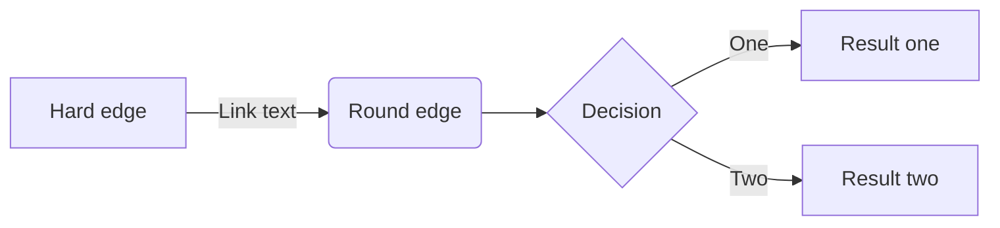
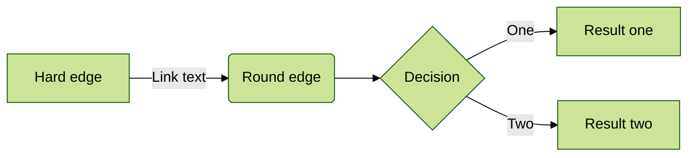
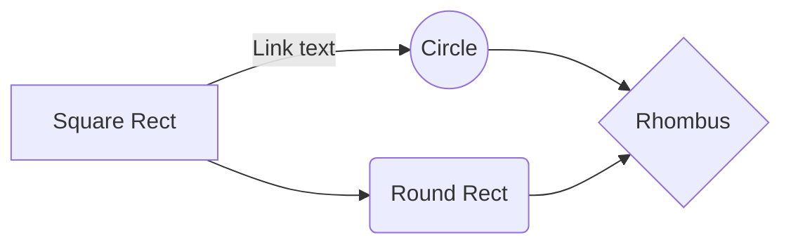
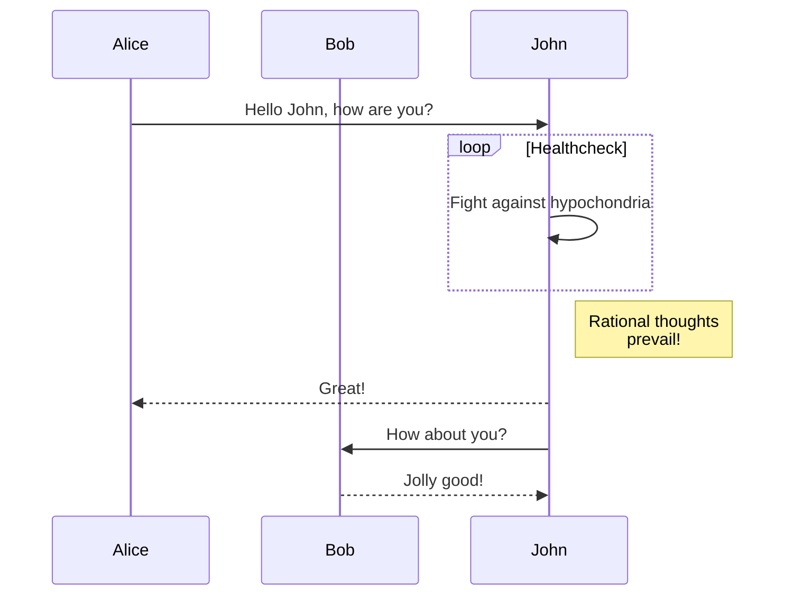
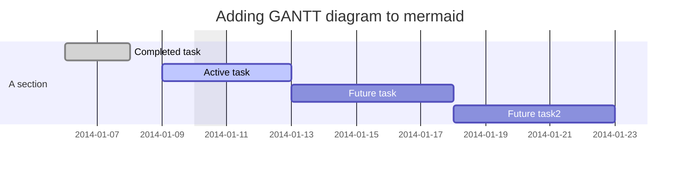
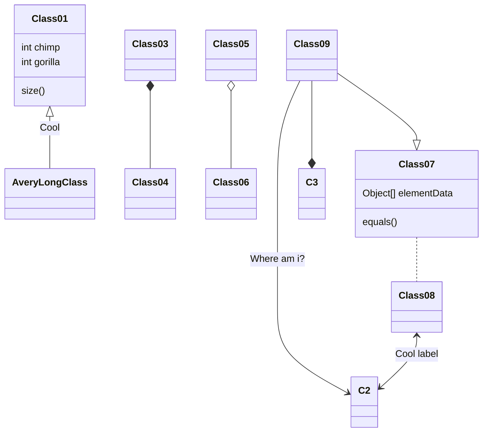
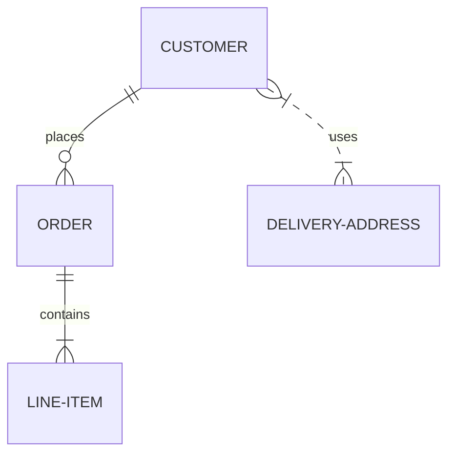
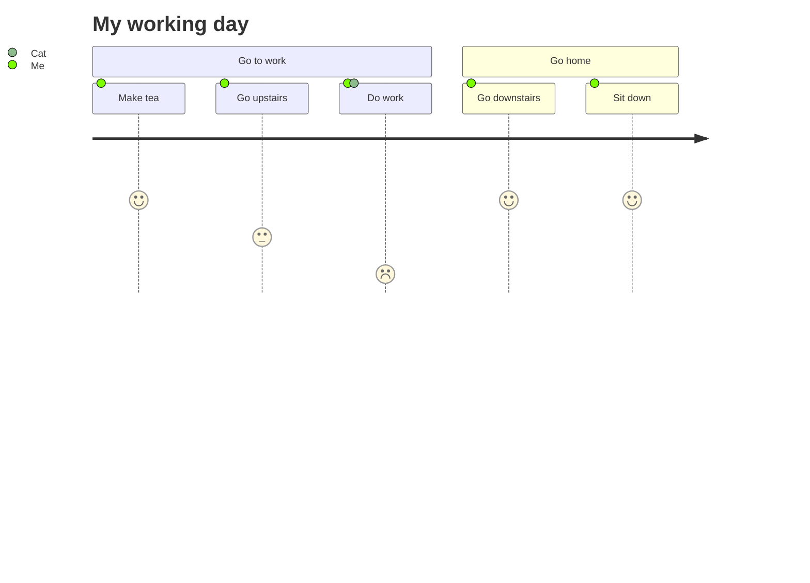
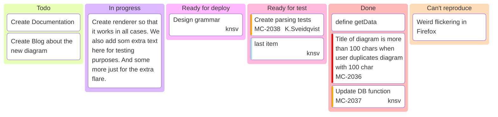
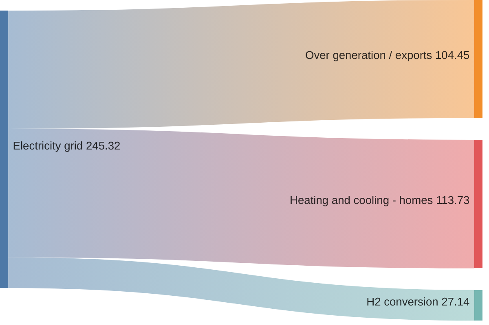

# Mermaid

[Mermaid](https://mermaid-js.github.io/mermaid) is a diagramming and charting tool that can be defined inside Markdown code blocks.


## Component syntax

With a similar syntax to code blocks, creating a Mermaid diagram requires a `` ``` `` code fence with the inclusion of the `mermaid` specifier.

~~~ Sample Mermaid diagram

~~~


---

## Directives

Mermaid [directives](https://mermaid-js.github.io/mermaid/#/directives) can be configured using the recommended `%%{init: { }}%%` syntax as the first line just inside the `` ```mermaid `` block.

From the Mermaid docs:

> Directives gives a diagram author the capability to alter the appearance of a diagram before rendering by changing the applied configuration.

All Mermaid directives are supported by Retype.

The following sample demonstrates applying a `theme` to the diagram:

~~~

~~~


### Syntax highlighting block

In order to draw a mermaid code block with syntax highlighting instead of rendering the contents, please use the `mermaid-js` block syntax specifier.

~~~

~~~


---

## Diagram types

### Flowchart

More details in the Mermaid [docs](https://mermaid-js.github.io/mermaid/#/flowchart).

~~~

~~~


### Sequence diagram

More details in the Mermaid [docs](https://mermaid-js.github.io/mermaid/#/sequenceDiagram).

~~~

~~~


### Gantt diagram

More details in the Mermaid [docs](https://mermaid-js.github.io/mermaid/#/gantt).

~~~

~~~


### Class diagram

More details in the Mermaid [docs](https://mermaid-js.github.io/mermaid/#/classDiagram).

~~~

~~~


### Entity Relationship

More details in the Mermaid [docs](https://mermaid-js.github.io/mermaid/#/entityRelationshipDiagram).

~~~

~~~


### User Journey

More details in the Mermaid [docs](https://mermaid-js.github.io/mermaid/#/user-journey).

~~~

~~~


### Kanban diagram

More details in the Mermaid [docs](https://mermaid.js.org/syntax/kanban.html).

~~~
kanban
  Todo
    [Create Documentation]
    docs[Create Blog about the new diagram]
  [In progress]
    id6[Create renderer so that it works in all cases. We also add som extra text here for testing purposes. And some more just for the extra flare.]
  id9[Ready for deploy]
    id8[Design grammar]@{ assigned: 'knsv' }
  id10[Ready for test]
    id4[Create parsing tests]@{ ticket: MC-2038, assigned: 'K.Sveidqvist', priority: 'High' }
    id66[last item]@{ priority: 'Very Low', assigned: 'knsv' }
  id11[Done]
    id5[define getData]
    id2[Title of diagram is more than 100 chars when user duplicates diagram with 100 char]@{ ticket: MC-2036, priority: 'Very High'}
    id3[Update DB function]@{ ticket: MC-2037, assigned: knsv, priority: 'High' }

  id12[Can't reproduce]
    id3[Weird flickering in Firefox]
~~~




### Sankey diagram

More details in the Mermaid [docs](https://mermaid.js.org/syntax/sankey.html).

~~~

~~~

```mermaid
sankey-beta

%% source,target,value
Electricity grid,Over generation / exports,104.453
Electricity grid,Heating and cooling - homes,113.726
Electricity grid,H2 conversion,27.14
```

### Architecture diagram

More details in the Mermaid [docs](https://mermaid.js.org/syntax/architecture.html).

~~~
architecture-beta
    group api(cloud)[API]

    service db(database)[Database] in api
    service disk1(disk)[Storage] in api
    service disk2(disk)[Storage] in api
    service server(server)[Server] in api

    db:L -- R:server
    disk1:T -- B:server
    disk2:T -- B:db
~~~

```mermaid
architecture-beta
    group api(cloud)[API]

    service db(database)[Database] in api
    service disk1(disk)[Storage] in api
    service disk2(disk)[Storage] in api
    service server(server)[Server] in api

    db:L -- R:server
    disk1:T -- B:server
    disk2:T -- B:db
```

### XY Chart

More details in the Mermaid [docs](https://mermaid.js.org/syntax/xyChart.html).

~~~
xychart-beta
    title "Sales Revenue"
    x-axis [jan, feb, mar, apr, may, jun, jul, aug, sep, oct, nov, dec]
    y-axis "Revenue (in $)" 4000 --> 11000
    bar [5000, 6000, 7500, 8200, 9500, 10500, 11000, 10200, 9200, 8500, 7000, 6000]
    line [5000, 6000, 7500, 8200, 9500, 10500, 11000, 10200, 9200, 8500, 7000, 6000]
~~~

```mermaid
xychart-beta
    title "Sales Revenue"
    x-axis [jan, feb, mar, apr, may, jun, jul, aug, sep, oct, nov, dec]
    y-axis "Revenue (in $)" 4000 --> 11000
    bar [5000, 6000, 7500, 8200, 9500, 10500, 11000, 10200, 9200, 8500, 7000, 6000]
    line [5000, 6000, 7500, 8200, 9500, 10500, 11000, 10200, 9200, 8500, 7000, 6000]
```

### Sequence diagram

More details in the Mermaid [docs](https://mermaid.js.org/syntax/examples.html#basic-sequence-diagram).

```mermaid
sequenceDiagram
    Alice ->> Bob: Hello Bob, how are you?
    Bob-->>John: How about you John?
    Bob--x Alice: I am good thanks!
    Bob-x John: I am good thanks!
    Note right of John: Bob thinks a long<br/>long time, so long<br/>that the text does<br/>not fit on a row.

    Bob-->Alice: Checking with John...
    Alice->John: Yes... John, how are you?
```

[!ref :mermaid: Mermaid website](https://mermaid-js.github.io/mermaid/)