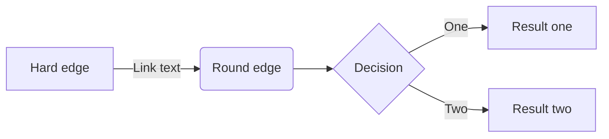
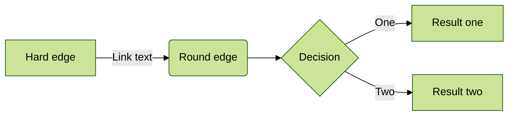
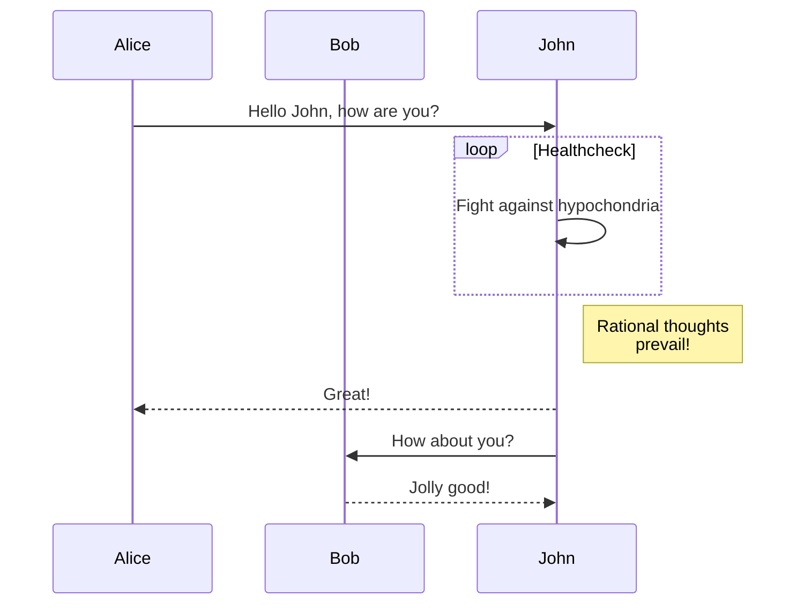
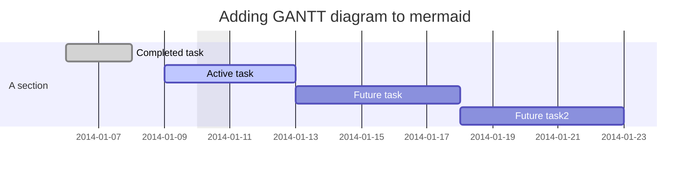
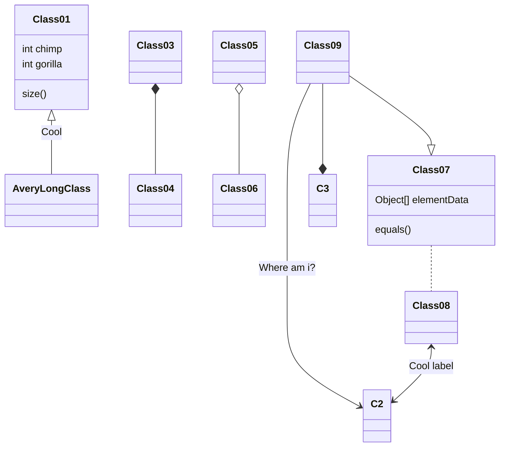

# Mermaid

[Mermaid](https://mermaid-js.github.io/mermaid) is a diagramming and charting tool that can be defined inside of Markdown code blocks.

## Component syntax

With a similar syntax to code blocks, creating a Mermaid diagram or chart requires a `` ``` `` code fence with the inclusion of the `mermaid` specifier.

~~~ Sample Mermaid diagram

~~~


---

## Directives

Mermaid [directives](https://mermaid-js.github.io/mermaid/#/directives) can be configured using the recommended `%%{init: { } }%%` syntax as the first line just inside the `` ```mermaid `` block.

From the Mermaid docs:

> Directives gives a diagram author the capability to alter the appearance of a diagram before rendering by changing the applied configuration.

All Mermaid directives are supported by Retype.

The following sample demonstrates applying a `theme` to the diagram:

~~~

~~~


---

## Diagram types

### Flowchart

~~~

~~~


### Sequence diagram

~~~

~~~


### Gantt diagram

~~~

~~~


### Class diagram

~~~

~~~


### Git graph

~~~

~~~

