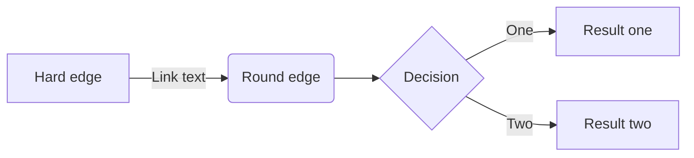
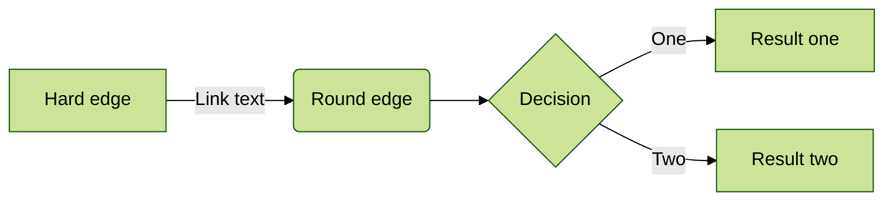
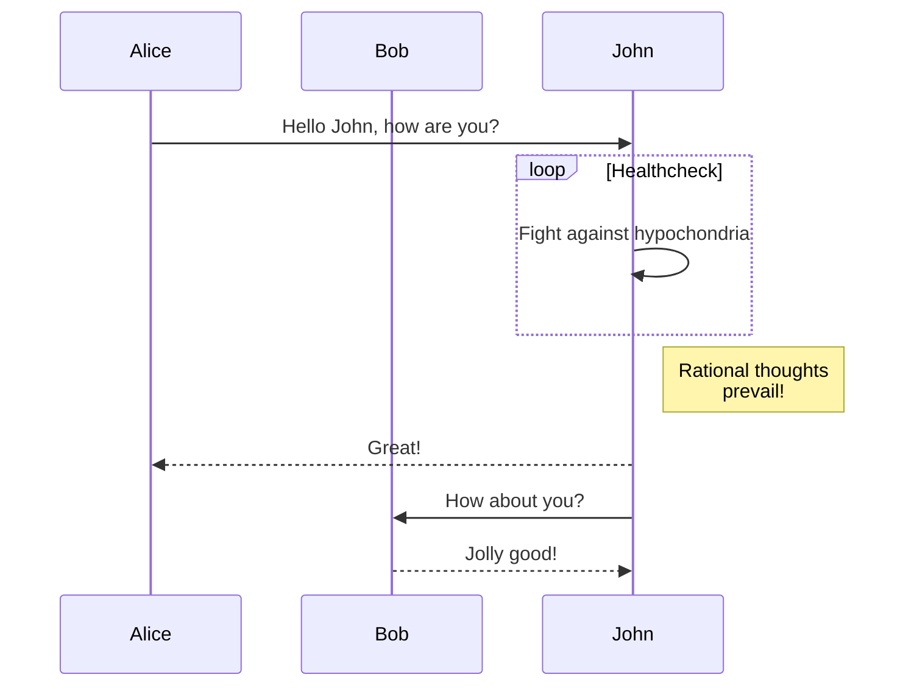
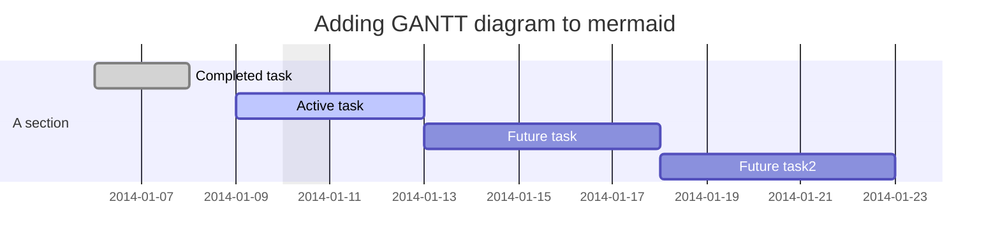
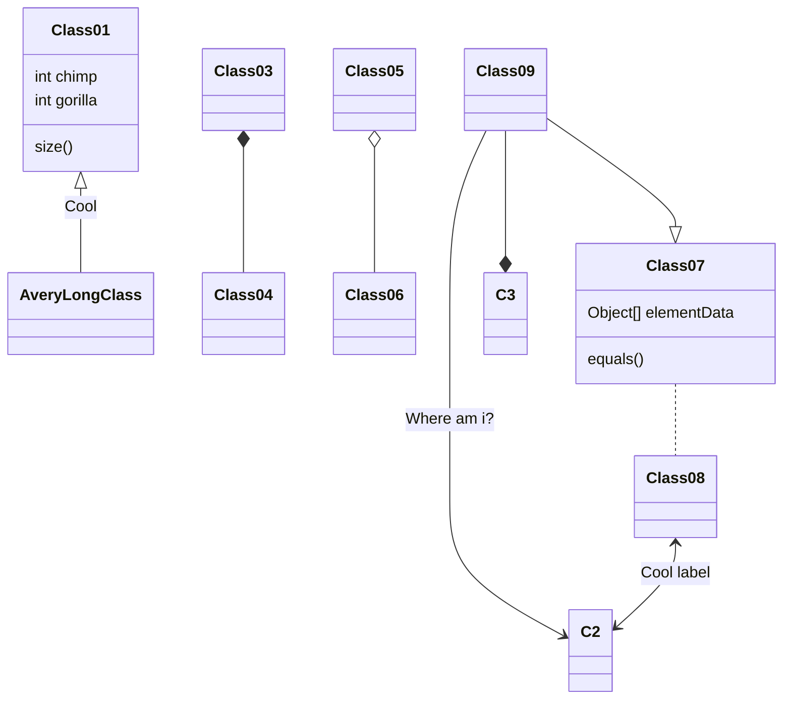
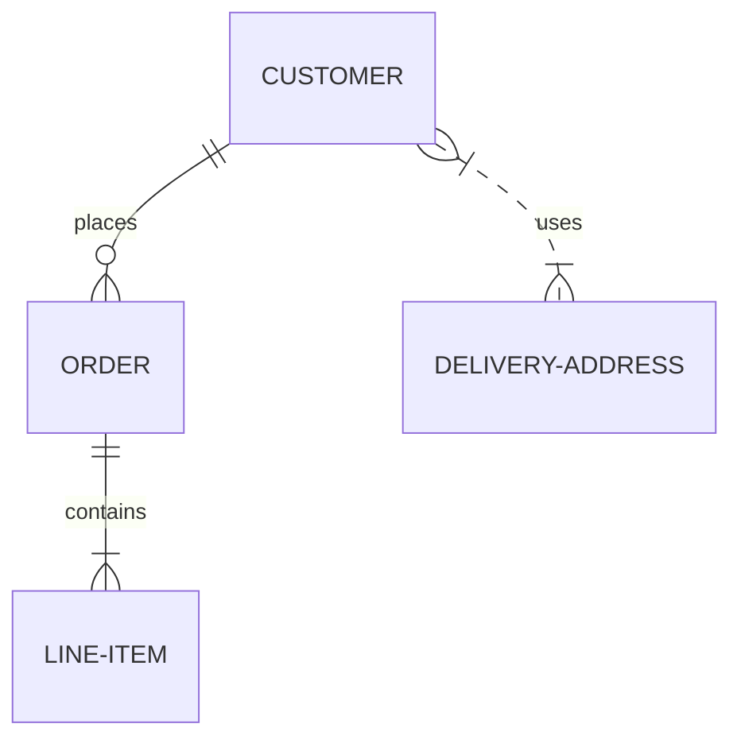
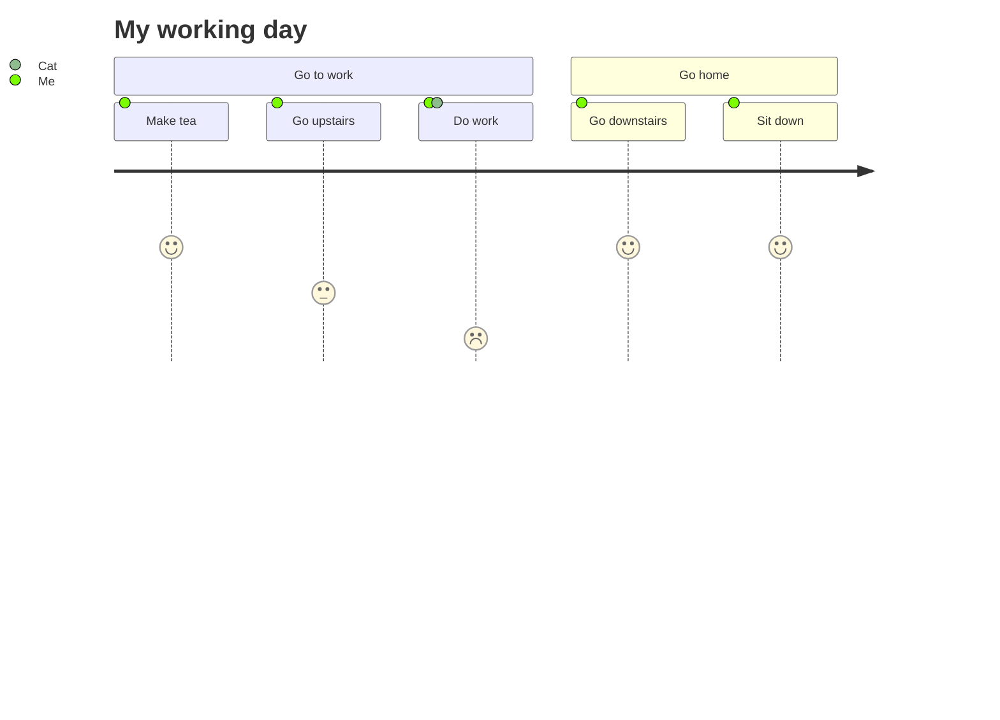

# Mermaid

[Mermaid](https://mermaid-js.github.io/mermaid) is a diagramming and charting tool that can be defined inside Markdown code blocks.


## Component syntax

With a similar syntax to code blocks, creating a Mermaid diagram requires a `` ``` `` code fence with the inclusion of the `mermaid` specifier.

~~~ Sample Mermaid diagram

~~~


---

## Directives

Mermaid [directives](https://mermaid-js.github.io/mermaid/#/directives) can be configured using the recommended `%%{init: { } }%%` syntax as the first line just inside the `` ```mermaid `` block.

From the Mermaid docs:

> Directives gives a diagram author the capability to alter the appearance of a diagram before rendering by changing the applied configuration.

All Mermaid directives are supported by Retype.

The following sample demonstrates applying a `theme` to the diagram:

~~~

~~~


### Syntax highlighting block

In order to draw a mermaid code block with syntax highlighting instead of rendering the contents, please use the `mermaid-js` block syntax specifier.

~~~

~~~


---

## Diagram types

### Flowchart

More details in Mermaid [docs](https://mermaid-js.github.io/mermaid/#/flowchart).

~~~

~~~


### Sequence diagram

More details in Mermaid [docs](https://mermaid-js.github.io/mermaid/#/sequenceDiagram).

~~~

~~~


### Gantt diagram

More details in Mermaid [docs](https://mermaid-js.github.io/mermaid/#/gantt).

~~~

~~~


### Class diagram

More details in Mermaid [docs](https://mermaid-js.github.io/mermaid/#/classDiagram).

~~~

~~~


### Entity Relationship

More details in Mermaid [docs](https://mermaid-js.github.io/mermaid/#/entityRelationshipDiagram).

~~~

~~~


### User Journey

More details in Mermaid [docs](https://mermaid-js.github.io/mermaid/#/user-journey).

~~~

~~~


[!ref :mermaid: Mermaid website](https://mermaid-js.github.io/mermaid/)