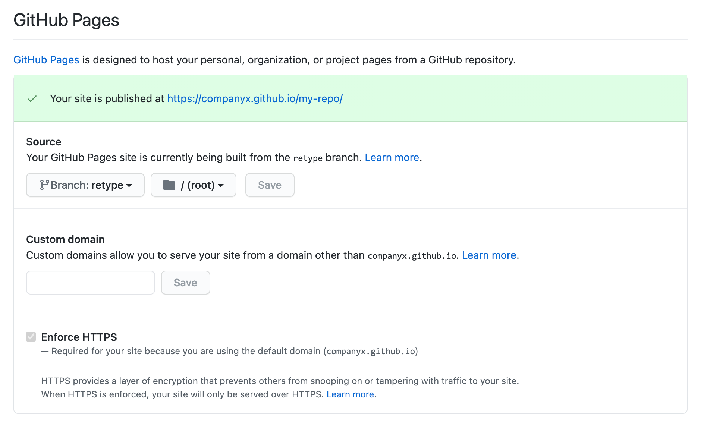

# Project configuration

Retype will read the `retype.json` file for additional instructions on how to configure and build your project.

The `retype.json` file is typically stored in the root of your project, although can be placed elsewhere. Please ensure the `input` and `output` paths are correct if moved to a different location.

!!!
After making a change to the `retype.json`, if you are running `retype watch`, Retype will automatically rebuild the project for you and your web browser will refresh with the changes.

If you started the local web server using `retype run`, you'll need to call `retype build` to regenerate a :sparkles: sparkly :sparkles: fresh new build of the project, then manually refresh your web browser to see update.
!!!

The `retype.json` file is actually optional (not required), but is recommended as you will almost certainly want to customize some options, so adding a `retype.json` is a good first step.

Running the command `retype init` will create a default `retype.json` file. The following sample demonstrates a common set of configuration options and everything can be customized to your requirements.

```json Sample retype.json
{
  "input": ".",
  "output": ".retype",

  "branding": {
    "title": "Project Name",
    "label": "Docs"
  },

  "links": [
    {
      "text": "Getting Started",
      "link": "https://retype.com/getting_started/"
    }
  ],

  "footer": {
    "copyright": "© Copyright {{ year }}. All rights reserved."
  }
}
```

---

## base

+++ base : `string`

Base subfolder path appended to all URL's. Default is `null` or empty string.

If you deploy the build website to a subfolder of another website, use the `base` to ensure the URL's correclty resolve.

For instance, let's say your main site is `https://example.com` and will remain unchanged.  If you would like to deploy the Retype built website into a `/docs` subfolder, with the final URL of `https://example.com/docs`, then setting `"base": "docs"` would be required.

```json Sample: Change output location to /docs folder
{
  "base": "docs"
}
```

Another common scenario for setting a `base` is when using GitHub Pages **without** a custom `CANME`.

For instance, if your GitHub organization was `CompanyX` and your repo was named `my-repo`, the URL to your GitHub Pages hosted website would be:

```
https://companyx.github.io/my-repo/
```

The Retype generated wesite would require `"base": "my-repo"` to be set within your projects `retype.json` file in order to properly resolve the URL paths during build.

The `retype.json` file for that scenario would be...

```json retype.json
{
  "base": "my-repo"
}
```

...and the GitHub Pages configuration within your repo Settings would be:


+++

---

## branding

Branding configuration for your Retype generated website.

### title

+++ title : `string`

Logo Title. Displayed when [logo](#logo) and [logoDark](#logoDark) are not configured. Default is `Project Name`.

```json Set the website title
{
  "branding": {
    "title": "Example.com"
  }
}
```

The above `title` would create the following branding title in the upper-left corner of the generated website.


+++

### label

+++ label : `string`

Optional Logo Label text. Default is `Docs`.

```json Set a custom label
{
  "branding": {
    "label": "v2.2"
  }
}
```
The `label` is rendered as the following label in the upper-left corner of the generated website, to the right of the [`title`](#title) or [`logo`](#logo).


+++

### logo

+++ logo : `string`

One of the following:

1. The path to a logo file relative to the [input](#input), or
2. An inline `<svg>` logo

Default is `null`.

```json Set a custom label
{
  "branding": {
    "logo": "static/logo.png"
  }
}
```
+++

### logoDark

+++ logoDark : `string`

One of the following:

1. The path to a logo file (dark mode) relative to the [input](#input), or
2. An inline `<svg>` logo

Default is `null`.

```json Set a custom label
{
  "branding": {
    "logo": "static/logo.png",
    "logoDark": "static/logo-dark.png"
  }
}
```
+++

### colors

Custom color configuration.

#### label.text

+++ label.text : `string`
Set a custom label text color. Default is `#1f7aff`.

```json
{
  "branding": {
    "colors": {
      "label": {
        "text": "#ffffff"
      }
    }
  }
}
```
+++

#### label.background

+++ label.background : `string`
Set a custom label background color. Default is `#e1edff`.

```json
{
  "branding": {
    "colors": {
      "label": {
        "background": "#ff0000"
      }
    }
  }
}
```
+++

---

## cname

+++ cname : `string`

If specified, a `CNAME` file with the corresponding value will be created and added to the root of the [output](#output). Default is `null`.

```json Sample: Host docs.example.com website using GitHub pages
{
  "cname": "docs.example.com"
}
```
+++

---

## edit

The `edit` config allows for enabling and customization of the `Edit this page` links on content pages.

!!!
Check out the bottom of this page for a working sample of `Edit this page`.
!!!

### repo

The repository URL where the source files for this project are located.

+++ repo : `string`
Setting a `repo` value will enable the `Edit this page` links on all content pages.

```json
{
  "edit": {
    "repo": "https://github.com/your-organization/your-repo"
  }
}
```
+++

### branch

+++ branch : `string`
Point to a custom branch within the repo. Default is `main`.

```json
{
  "edit": {
    "repo": "https://github.com/your-organization/your-repo",
    "branch": "website"
  }
}
```
+++

### base

+++ base : `string`
A base folder within from the root of the project where the source content files are located. By default, the root of the repo is assumed.

The following sample demonstrates a scenario where the content files are located within the `/docs` sub-folder of the repo.

```json
{
  "edit": {
    "repo": "https://github.com/your-organization/your-repo",
    "base": "docs"
  }
}
```
+++

### label

+++ label : `string`
A custom label for the link. Default is `"Edit this page"`.

```
{
  "edit": {
    "repo": "https://github.com/your-organization/your-repo",
    "label": "Edit on GitHub"
  }
}
```
+++

---

## exclude

+++ exclude : `array`
Retype can exclude files or folders from being built by configuring an `exclude` string array within your projects `retype.json` file.

Exclude patterns are similar to allowable patterns within a `.gitignore` file. The wildcards `?` and `*` are allowed.

The following sample demonstrates how to exclude an entire `draft/` folder, any folder that ends with `*_temp/`, and one specific `/src/temp.md` file.

```json Exclude patterns
{
  "exclude": [
    "draft/",
    "*_temp/",
    "/src/temp.md"
  ]
}
```

You could exclude everything in your project with by adding `"exclude": [ "*" ]`.

!!!
Any file are folder prefixed with an underscore `_` are also excluded.
!!!
+++

---

## favicon

+++ favicon : `string`

A custom path to a `.ico` or `.png` file to be used as the `favicon`. Default is `null`.

The path is relative to the [input](#input).

```json Favicon is stored in the /static folder
{
  "favicon": "static/favicon.png"
}
```

By default, Retype will look for a `favicon.ico` or `favicon.png` within the root of the [input](#input). The `favicon` config would typically only be used if you want to store the `favicon` file in a subfolder of the [output](#output) root.
+++

---

## footer

+++ copyright : `string`
Site-wide copyright statement that will be added to the footer of each page. Supports Markdown syntax and `{{ year }}` variable.

```json
{
  "footer": {
    "copyright": "© Copyright {{ year }}. [Example, Inc.](https://example.come/) All rights reserved.",
  }
}
```
+++

+++ links : `object`
Same configuration options as page level [`links`](#links).

```json
{
  "footer": {
    "links": [
      {
        "text": "License",
        "link": "license.md"
      }
    ]
  }
}
```
+++

---

## input

+++ input : `string`

Custom path to the input directory. Default is `.`.

The path is relative to the `retype.json` location.

```json Change input location to /src folder
{
  "input": "./src"
}
```
+++

---

## links

Custom links added to the top-bar navigation of all pages.

The following sample demonstrates a basic `links` scenario which would add one link to the top of all pages.

```json
{
  "links": [
    {
      "text": "Getting Started",
      "link": "https://retype.com/getting_started/"
    }
  ]
}
```

### text

+++ text : `string`

The link text label.

```json
{
  "links": [
    {
      "text": "Demos",
      "link": "https://demo.example.com/"
    }
  ]
}
```
+++

### link

+++ link : `string`

The URL to use for the link. The link can be internal or external.

```json
{
  "links": [
    {
      "text": "About us",
      "link": "/about/"
    }
  ]
}
```
+++

### icon

+++ icon : `string`

An icon to use with the link. Default is `null`.

```json
{
  "links": [
    {
      "text": "Issues",
      "link": "https://github.com/retypeapp/retype/issues/",
      "icon": "bug"
    }
  ]
}
```

Options include using an [Octicon](https://octicons-primer.vercel.app/octicons/) name, [Emoji](https://mojee.io/emojis/) shortcode, `<svg>` element, a path to the icon file.

```yml Octicon
"icon": "rocket"
```

```yml Emoji shortcode
"icon": ":rocket:"
```

```yml SVG element
"icon": "<svg>...</svg>"
```

```yml Path
"icon": "../static/rocket.png"
```
+++

### iconAlign

+++ iconAlign : `string`

The position for the icon relative to the link `text`. Either `left` or `right`. Default is `left`.

```json
{
  "links": [
    {
      "text": "Demos",
      "link": "https://demo.example.com/",
      "icon": "link-external",
      "iconAlign": "right"
    }
  ]
}
```
+++

---

## meta

Meta tag configuration.

### title

+++ title : `string`

Common site-wide suffix appended to the html `<title>` element of all pages. Default is `null`.

```json Append this string to all page meta tag titles
{
  "meta": {
    "title": " | Example.com - Widgets for the internet"
  }
}
```

If we had an `About us` page, the final `<title>` with the `title` value above would be:

```html
<title>About us | Example.com - Widgets for the internet</title>
```
+++

---

## output

+++ output : `string`

Custom path to the output directory. Default is `.retype`.

The path is relative to the `retype.json` location.

```json Sample: Change output location to /docs folder
{
  "output": "./docs"
}
```
+++

---

## plugins

### googleAnalytics

Add Google Analytics to your website.

+++ googleAnalytics.id : `string`
Google Analytics ID value.

```json
{
  "plugins": {
    "googleAnalytics": {
      "id": "UA-12345678-1"
    }
  }
}
```
+++

---

## port

+++ port : `number`

A custom port for the internal Retype web server to use when hosting locally. Default is `5000`.

```json
{
  "port": 5005
}
```

If the default port is already being used by another service, Retype will auto-increment the port number until it finds an open port to host from.

If a custom `port` is explicitly configured in the `retype.json`, and if that port is already being used by another service, Retype will write a message to the console and exit. In that scenario, because the `port` was explicitly configured, Retype will not attempt to auto-increment.
+++

---

## search

Customization of the website search component.

### minChars

+++ minChars : `number`
Min number of characters required in a search query. Defualt is `3`.

```json
{
  "search": {
    "minChars": 3
  }
}
```
+++

### maxResults

+++ maxResults : `number`
Max number of search results to render. Defualt is `20`.

```json
{
  "search": {
    "maxResults": 20
  }
}
```
+++

### placeholder

+++ placeholder : `string`
Placeholder text rendered on the search component. Defualt is `"Search"`.

```json
{
  "search": {
    "placeholder": "Search"
  }
}
```
+++

### hotkeys

+++ hotkeys : `string[]`
Keyboard key to set the cursor focus into the search field. Defualt is `["/"]`.

```json
{
  "search": {
    "hotkeys": ["/"]
  }
}
```
+++

### noResultsFoundMsg

+++ noResultsFoundMsg : `string`
Message rendered when no results were found. Defualt is `"Sorry, no results found."`.

```json
{
  "search": {
    "noResultsFoundMsg": "Sorry, no results found."
  }
}
```
+++

---

## snippets

The `snippets` configuration allows for the project with custom configuration of code block formatting, including the project wide enabling of [line numbering](../components/code_block.md#line-numbers).

### lineNumbers

+++ lineNumbers : `string[]`

An array of code block reference language strings to enable line numbering on. Default is `null`.

~~~json Enable line numbering for `js` and `json` code blocks site wide
{
  "snippets": {
    "lineNumbers": [ "js", "json" ]
  }
}
~~~

Configuring the `"*"` wildcard will enable line numbering for **all** code block types, including code blocks with no explicit reference language.

~~~json Enable line numbering for all code blocks site wide
{
  "snippets": {
    "lineNumbers": [ "*" ]
  }
}
~~~

Enabling line numbering site wide on code blocks with no explicit reference language is configured with the none `"none"` specifier.

~~~json Enable line numbering for all unspecified code blocks site wide
{
  "snippets": {
    "lineNumbers": [ "none" ]
  }
}
~~~
+++

---

## Additional options

| Option                               | Type      | Default value              | Description                                                                                                                     |
| ------------------------------------ | --------- | -------------------------- | ------------------------------------------------------------------------------------------------------------------------------- |
| `code`                               | `object`  |                            | Source code reference configuration                                                                                             |
| `code.input`                         | `string`  |                            | Path to a project file, or a project directory                                                                                  |
| `code.output`                        | `string`  | `./api`                    | Custom path to the API output directory. Relative to `output`                                                                   |
