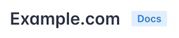

# Project configuration

Retype will read the `retype.yml` file for additional instructions on how to configure and build your project.

The `retype.yml` file is typically placed in the root of your project, although it can be placed elsewhere. Please ensure the [`input`](#input) and [`output`](#output) paths are correct if moved to a different location.

!!!
After making a change to the `retype.yml`, if you are running `retype watch`, Retype will automatically rebuild the project for you and your web browser will refresh with the changes.

If you started the local web server using `retype run`, you'll need to call `retype build` to regenerate a :sparkles: sparkly :sparkles: fresh new build of the project, then manually refresh your web browser to see the update.
!!!

The `retype.yml` file is actually optional (not required), but is recommended as you will almost certainly want to customize some options, so adding a `retype.yml` is a good first step.

If you run the command `retype watch` and do not have a `retype.yml` project configuration file within the root of your project, Retype will auto-generate a simple `retype.yml` file for your project. You can then edit the file to customize your project.

You can also explicitly have Retype generate a `retype.yml` file by running the command `retype init`.

The following sample demonstrates a common set of project configuration options and everything can be customized to your requirements.

```yml Sample retype.yml
input: .
output: .retype
url: # Add your website address here
branding:
  title: Project Name
  label: Docs
links:
  - text: Getting Started
    link: https://retype.com/guides/getting-started/
footer:
  copyright: "&copy; Copyright {{ year }}. All rights reserved."
```

---

## branding

Branding configuration for your Retype generated website.

### title

=== title : `string`

The main text title added to the upper-left corner of the generated website.

The `title` can be used in conjunction with [`logo`](#logo) and [`logoDark`](#logodark). If a `title` and `logo` are configured, both will be added to the website. If only a `title` is configured, only the text title is used. If only a `logo` and/or `logoDark` are configured, only the logos are used.

```yml Set the website title
branding:
  title: Example.com
```

The above `title` would create the following branding title in the upper-left corner of the generated website.


===

### label

=== label : `string`

Optional logo label text. Default is `Docs`.

```yml Set a custom label
branding:
  label: Docs
```
The `label` is rendered as the following label in the upper-left corner of the generated website, to the right of the [`title`](#title) or [`logo`](#logo).


===

### logo

=== logo : `string`

One of the following:

1. The path to a logo file relative to the [`input`](#input), or
2. An inline `<svg>` logo

Default is `null`.

```yml Set a custom label
branding:
  logo: static/logo.png
```
===

### logoDark

=== logoDark : `string`

One of the following:

1. The path to a logo file (dark mode) relative to the [`input`](#input), or
2. An inline `<svg>` logo

Default is `null`.

```yml Set a custom label
branding:
  logo: static/logo.png
  logoDark: static/logo-dark.png
```
===

### logoAlign

=== logoAlign : `string`

Set a logo image alignment relative to the [`title`](#title). Supported values include `left` and `right`.

Default is `left`.

```yml
branding:
  logo: static/logo.png
  logoAlign: right
```
===

### colors

Custom color configuration.

#### label.text

=== label.text : `string`
Set a custom label text color. Default is `#1f7aff`.

```yml
branding:
  colors:
    label:
      text: #ffffff
```
===

#### label.background

=== label.background : `string`
Set a custom label background color. Default is `#e1edff`.

```yml
branding:
  colors:
    label:
      background: #ff0000
```
===

---

## cache

Cache configuration options.

### busting

Cache busting configuration for the website resources.
Helps to ensure a loaded page refers to the most recent JavaScript and CSS resources.

=== strategy : `string`

Specifies the approach Retype will use for cache invalidation. 

| Strategy     | Description |
| ------------ | ----------- |
| `none`       | Cache invalidation is disabled. |
| `path`       | Cache invalidation is achieved by concatinating the file name with a version token. |
| `query`      | Cache invalidation is achieved by adding a query parameter with a version token value. |

Default is `query`.

Below are demo URLs generated for corresponding `cache.busting.strategy` options:

~~~html `strategy: none`
<script type="text/javascript" src="/resources/js/retype.js" />
~~~

~~~html `strategy: path`
<script type="text/javascript" src="/resources/js/retype.v1.10.js" />
~~~

~~~html `strategy: query`
<script type="text/javascript" src="/resources/js/retype.js?v=1.10" />
~~~

===

=== token : `string`

An optional unique token used for website resource cache invalidation.

- If specified, the provided value is used for all invalidatable resources as is.
- If not specified, the default token having the following structure is used:  
`{Retype version}.{total milliseconds elapsed since 2000-01-01}`

===

---

## cname

=== cname : `boolean` or `string`

!!!
In general, you should not require setting the `cname`. Please set the [`url`](#url).
!!!

By default, if the [`url`](#url) is set, Retype will automatically generate a `CNAME` file. This can be disabled by setting `cname: false`.

```yml Disable CNAME file generation
cname: false
```

If you do want a `CNAME` file generated, but for some reason require a value different than what the `url` creates, you can explicitly set instruct Retype to generate the `CNAME` with a different value.

This would be a highly unusual scenario, but Retype does allow you to configure these values separately, just in case you need it. We **HIGHLY** recommend that you just stick with setting the [`url`](#url).

```yml Custom CNAME file value
cname: docs.example.com
```

===

---

## edit

The `edit` config allows for enabling and customization of the `Edit this page` links on content pages.

!!!
Check out the bottom of this page for a working sample of `Edit this page`.
!!!

### repo

The repository URL where the source files for this project are located.

=== repo : `string`
Setting a `repo` value will enable the `Edit this page` links on all content pages.

```yml
edit:
  repo: "https://github.com/<your-organization>/<your-repo>/"
```

You can also configurate the links to point directly to the `/edit/` view of the page:

```yml
edit:
  repo: "https://github.com/<your-organization>/<your-repo>/edit/"
```

===

### branch

=== branch : `string`
Point to a custom branch within the repo. Default is `main`.

```yml
edit:
  repo: "https://github.com/your-organization/your-repo"
  branch: website
```
===

### label

=== label : `string`
A custom label for the link. Default is `"Edit this page"`.

```yml
edit:
  repo: "https://github.com/your-organization/your-repo"
  label: Edit on GitHub
```
===

---

## exclude

=== exclude : `list`
Retype can exclude files or folders from being built or copied to the [`output`](#output) by configuring an `exclude` list within your projects `retype.yml` file.

Exclude patterns are similar to allowable patterns within a `.gitignore` file. The wildcards `?`, `*`, `**`, and `!` are supported.

The following sample demonstrates how to exclude an entire `draft/` folder, any folder that ends with `*_temp/`, and one specific `/src/temp.md` file.

```yml Exclude patterns
exclude:
  - "draft/"
  - "*_temp/"
  - "/src/temp.md"
```

You could exclude everything in your project with by adding `exclude: [ * ]`.

!!!
By default, any file or folder name prefixed with a `.` or a `_` will be excluded.

As well, any `node_modules` folder will be excluded.
!!!

To explicitly include any files or folders that might have been excluded, please see the [`include`](#include) config.
===

---

## favicon

=== favicon : `string`

A custom path to a `.ico` or `.png` file to be used as the `favicon`. Default is `null`.

The path is relative to the [`input`](#input).

```yml Favicon is stored in the /static folder
favicon: static/favicon.png
```

By default, Retype will look for a `favicon.ico` or `favicon.png` within the root of the [`input`](#input). The `favicon` config would typically only be used if you want to store the `favicon` file in a subfolder of the [`output`](#output) root.
===

---

## footer

### copyright

=== copyright : `string`
Site-wide copyright statement that will be added to the footer of each page. Supports Markdown syntax and `{{ year }}` variable.

```yml
footer:
  copyright: "© Copyright {{ year }}. [Example, Inc.](https://example.com/) All rights reserved."
```
===

### links (footer)

=== links : `object`
The `footer.links` have the same configuration options as [`links`](#links).

```yml
footer:
  links:
    - text: License
      link: license.md
```
===

---

## include

=== include : `list`
Retype can explicitly include files or folders that might have been excluded by default or excluded within the [`exclude`](#exclude) config.

!!!

If you create a link to local static file, such as `.zip` file, Retype will automatically copy that file to the generated website.

That file or file type does not need to be explicitly configured to be included. Retype assumes that if you created a link to the file, you wanted that file published and it will be included in the [`output`](#output).

!!!

Include patterns are similar to allowable patterns within a `.gitignore` file. The wildcards `?`, `*`, `**`, and `!` are supported.

The following sample demonstrates how to include all `.py` files and the entire contents of any `www` folder within the project.

```yml Include patterns
include:
  - *.py
  - **/www/**
```

You could explicitly include everything in your project with `include: [ * ]`, BUT be careful as all files within your [`input`](#input) will be publicly availble once your website is published. We would not recommend doing this, but it's your call. :fearful:

Retype treats all `.md` and `.yml` files as parsable content files that will be converted into `.html` files and are not copied over to the [`output`](#output). All other included file types would be copied straight across to the `output` unchanged and become static files that can be linked to.

By default, if Retype discovers any of the following file types, they will be automatically included and copied over to the `output` unchanged. If you require any other file types, they would need to be explicitly added to the `include` config.

Included file types:

- `*.gif`
- `*.heif`
- `*.jpeg`
- `*.jpg`
- `*.png`
- `*.svg`
- `*.webp`
- `*.ai`
- `*.bmp`
- `*.eps`
- `*.pdf`
- `*.tiff`
- `*.txt`

By default, if Retype discovers any of the following folders anywhere within the project, the folder and its entire contents will be copied over to the `output` unchanged. If you require any other folders, please add to the `include` config.

Included folders:

- `**/static/**`
- `**/public/**`
- `**/assets/**`
- `**/resources/**`

If you would rather not include certain folders, files, or file types, please add the pattern to the [`exclude`](#exclude) config.

===

---

## input

=== input : `string`

Custom path to the input directory. Default is `.`.

The path is relative to the `retype.yml` location.

```yml Change input location to /src folder
input: ./src
```
===

---

## integrations

More `integrations` will be added over time. Do you have an integration suggestion? [let us know](https://github.com/retypeapp/retype/discussions).

### googleAnalytics

Add Google Analytics to your website.

=== googleAnalytics.id : `string`
Google Analytics ID value.

```yml
integrations:
  googleAnalytics:
    id: UA-12345678-1
```
===

---

## links

Custom links added to the top-bar navigation of all pages.

The following sample demonstrates a basic `links` scenario which would add one link to the top bar of all pages.

```yml
links:
  - text: Getting Started
    link: https://retype.com/getting_started/
```

### text

=== text : `string`

The link text label.

```yml
links:
  - text: Demos
    link: https://demo.example.com/
```
===

### link

=== link : `string`

The URL to use for the link. The link can be a `.md` file name, or to any internal path, or to any external URL.

If a `.md` file set, such as `sample.md`, Retype will automatically resolve the path and in the generated website, the `sample.md` value will be replaced with the path to the actual generated HTML file.

```yml
links:
  - text: About us
    link: /about/
```
===

### icon

=== icon : `string`

An icon to use with the link. Default is `null`.

```yml
links:
  - text: Issues
    link: https://github.com/retypeapp/retype/issues/
    icon: bug
```

Options include using an [Octicon](https://octicons-primer.vercel.app/octicons/) name, [Emoji](https://mojee.io/emojis/) shortcode, `<svg>` element, or a path to an image file.

```yml Octicon
icon: rocket
```

```yml Emoji shortcode
icon: :rocket:
```

```yml SVG element
icon: <svg>...</svg>
```

```yml Path
icon: ../static/rocket.png
```
===

### iconAlign

=== iconAlign : `string`

The position for the icon relative to the link `text`. Either `left` or `right`. Default is `left`.

```yml
links:
  - text: Demos
    link: https://demo.example.com/
    icon: link-external
    iconAlign: right
```
===


### target

=== target : `string`

Sets the `target` attribute of the hyperlink and specifies which window or tab to open the link into.

```yml
links:
  - text: Demos
    link: https://demo.example.com/
    target: blank
```

If no `target` is configured, the link will open in the current tab.

The `target` can be set to any value, although `blank` is common and will open the link in a new tab. Retype will automatically transform the value `blank` into `_blank` which is the actual value required by the browser to indicate that a hyperlink should be opened in a new tab.

There are several other values that may be prefixed with an `_` character, including `self`, `parent`, and `top`. The following table demonstrates some common scenarios and naming convention used by Retype to normalize the `target` values.

| Config `target` value | Runtime `target` value |
| --------------------- | ---------------------- |
| `blank`               | `_blank`               |
| `parent`              | `_parent`              |
| `top`                 | `_top`                 |
| `self`                | `_self`                |
| `news1`               | `news1`                |
| `nEWs2`               | `news2`                |
| `recent NEWS`         | `recent-news`          |

===

---

## markdown

Markdown configuration options.

### lineBreaks

=== lineBreaks : `string`

Switches between `soft` and `hard` line break modes. The option instructs Retype in what way a regular line ending should be handled.

- in `soft` mode, regular line breaks are processed as [soft breaks](https://spec.commonmark.org/0.30/#soft-line-breaks) (no `<br />` is emitted to HTML markup), unless a line contains 2+ spaces before a line break.
- in `hard` mode, regular line breaks are always emitted as `<br />` HTML elements.

Default is `soft`.

===

---

## meta

Project wide meta tag configuration options.

### title

=== title : `string`

Common site-wide suffix appended to the html `<title>` element of all pages. Default is `null`.

```yml Append this string to all page meta tag titles
meta:
  title: " | Example.com - Widgets for the internet"
```

If we had an `About us` page, the final `<title>` with the `title` value above would be:

```html
<title>About us | Example.com - Widgets for the internet</title>
```
===
---

## output

=== output : `string`

Custom path to the output directory. Default is `.retype`.

The path is relative to the `retype.yml` location.

```yml Change output location to /docs folder
output: ./docs
```
===

---

## search

Customization of the website search component.

### minChars

=== minChars : `number`
Min number of characters required in a search query. Default is `3`.

```yml
search:
  minChars: 3
```
===

### maxResults

=== maxResults : `number`
Max number of search results to render. Default is `20`.

```yml
search:
  maxResults: 20
```
===

### placeholder

=== placeholder : `string`
Placeholder text rendered on the search component. Default is `"Search"`.

```yml
search:
  placeholder: Search
```
===

### hotkeys

=== hotkeys : `list`
Keyboard key to set the cursor focus into the search field. Default is `["/"]`.

```yml
search:
  hotkeys:
    - "/"
```
===

### noResultsFoundMsg

=== noResultsFoundMsg : `string`
Message rendered when no results were found. Default is `"Sorry, no results found."`.

```yml
search:
  noResultsFoundMsg: Sorry, no results found.
```
===

## server

Custom configuration for the built in Retype development web server.

### host

=== host : `string`

Serve the website from this host location. Default is `localhost`.

```yml
server:
  host: 127.0.0.1
```

By default, the Retype development web server will serve from `http://localhost:5000`, although the port could be dynamically assigned if port `5000` is already in use.

A custom port value can also be assigned.

```yml
server:
  host: 127.0.0.1:5005
```

A custom `--host` value can also be passed as an argument to the [`retype watch`](../guides/cli.md#options) and [`retype run`](../guides/cli.md#options-3) commands. If included, the `--host` value will override the `host` set within your `retype.yml` project configuration file.

```
retype watch --host 127.0.0.1              # serve from a custom host
retype watch --host 127.0.0.1 --port 5005  # serve from a custom host and port
```

===

### port

=== port : `number`

A custom port for the internal Retype development web server to use when hosting locally. Default is `5000`.

```yml
server:
  port: 5005
```

If the default port is already being used by another service, Retype will auto-increment the port number until it finds an open port to host from.

If a custom `port` is explicitly configured in the `retype.yml` and if that port is already being used by another service, Retype will write a message to the console and exit. In that scenario, because the `port` was explicitly configured, Retype will not attempt to auto-increment.

!!!

The port number can also be included in the [`host`](#host) config.

!!!

A custom `--port` value can also be passed as an argument to the [`retype watch`](../guides/cli.md#options) and [`retype run`](../guides/cli.md#options-3) commands. If included, the `--port` value will override the `port` set within your `retype.yml` project configuration file.

```
retype watch --port 5005  # serve from a custom port
```

===

### watch

Custom configuration for the [`retype watch`](../guides/cli.md#options) command.

=== mode : `string`

During `retype watch`, the `mode` configuration instructs the web server on where to host files from.

If `memory`, the entire website is built and then stored in memory during development with no files being written to disk.

If `disk`, the entire website is built and written to disk, then the web server will host those files from their disk location.

Default is `memory`.

| Mode     | Description |
| -------- | ----------- |
| `memory` | No output files are written to a disk. Retype serves a website from the in-memory storage. |
| `disk`   | Output files are written to the [`output`](#output) directory, and updated with each incremental build accordingly. |

```yml
server:
  watch:
    mode: disk
```

The command [`retype build`](../guides/cli.md#retype-build) will always build and write all files to disk. The `memory` configuration is not an option with `retype build`. The Retype [GitHub Action](..guides/github-actions.md) uses `retype build`. The command `retype watch` is only to be used during local development.

===

---

## snippets

The `snippets` configuration allows for the project with custom configuration of code block formatting, including the project wide enabling of [line numbering](../components/code-block.md#line-numbers).

### lineNumbers

=== lineNumbers : `list`

A list of code block reference language strings to enable line numbering on. Default is `null`.

~~~yml Enable line numbering for `js` and `json` code blocks site wide
snippets:
  lineNumbers:
    - js
    - json
~~~

Configuring the `"*"` wildcard will enable line numbering for **all** code block types, including code blocks with no explicit reference language.

```yml Enable line numbering for all code blocks site wide
snippets:
  lineNumbers:
    - *
```

Enabling line numbering site wide on code blocks with no explicit reference language is configured with the none `"none"` specifier.

```yml Enable line numbering for all unspecified code blocks site wide
snippets:
  lineNumbers:
    - none
```
===

---

## url

=== url : `string`

The base URL of your website.

```yml
url: example.com
```

The `url` can also be a sub-domain.

```yml
url: docs.example.com
```

If you deploy your Retype generated website into the subfolder of another website, add the subfolder in the `url`. For example, if the website will be available at `https://example.com/docs`, add that `docs` folder name to the `url`.

```yml
url: example.com/docs
```

If no protocol is supplied, such as `https` or `http`, Retype will assume `https`. A protocol can be explicitly defined by passing in the `url`.

```yml
url: http://example.com/docs/
```

Another common scenario for setting a `url` is when using [GitHub Pages](../guides/github-actions.md) **without** a custom `CNAME`.

For instance, if your GitHub organization was `CompanyX` and your repo was named `docs`, the URL to your GitHub Pages hosted website would be `https://companyx.github.io/docs/`.

Retype needs to know where your website will be hosted, so the `url` configuration for the above scenario would be:

```yml
url: companyx.github.io/docs
```

===

---

## Additional options

| Option       | Type     | Default value | Description                                                   |
| ------------ | -------- | ------------- | ------------------------------------------------------------- |
| `api`        | `object` |               | API reference doc generation                                  |
| `api.input`  | `string` |               | Path to a project file or a project directory                 |
| `api.output` | `string` | `./api`       | Custom path to the API output directory. Relative to `output` |
