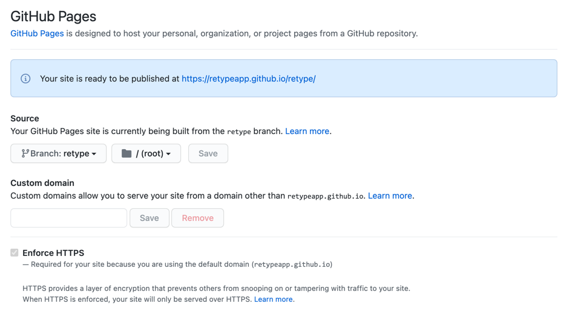
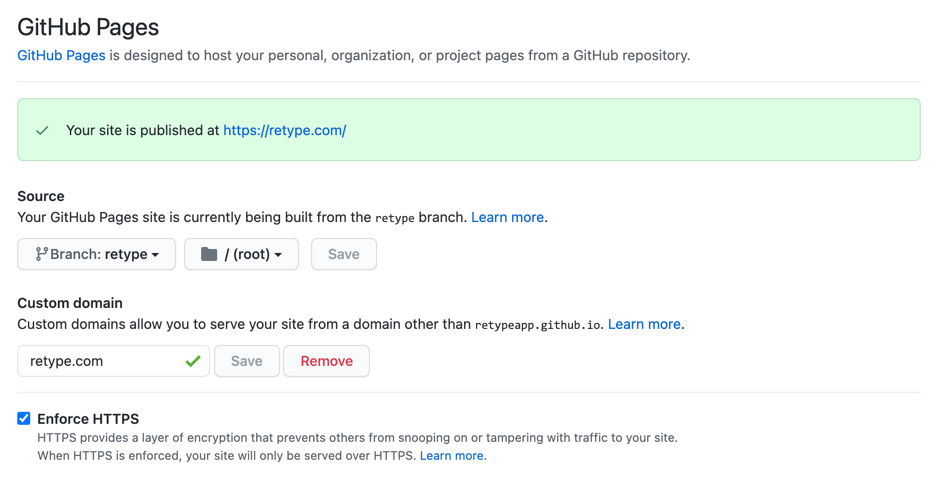

# GitHub Actions

Add a simple GitHub Action to your project to automate the building and deployment of your Retype powered website.

Currently, there are two Retype related GitHub Actions:

1. Retype [Build Action](https://github.com/retypeapp/action-build)
2. Retype [GitHub Pages Action](https://github.com/retypeapp/action-github-pages)

The first, **Build Action** will automatically build your Retype powered website with each new change that is committed.

The second, **GitHub Pages Action** will automatically publish your newly built website to a branch in Github so it's available to host from GitHub Pages. By default, the `retype` branch is used, but of course that is also configurable.

Automatically deploying to GitHub Pages requires a basic `retype.yml` configuration file to be added to your GitHub repo and some simple project configuration.

## Step 1: Add `retype.yml` workflow

Add the following `retype.yml` file to your GitHub project within the `.github/workflows/` folder.

If the `.github/workflows/` folder does not exist within the root of your project, you can manually create those folders and they will be committed along with the `retype.yml`.

``` .github/workflows/retype.yml
name: Publish Retype powered website to GitHub Pages
on:
  workflow_dispatch:
  push:
    branches:
      - main

jobs:
  publish:
    name: Publish to retype branch

    runs-on: ubuntu-latest

    steps:
      - uses: actions/checkout@v2

      - uses: actions/setup-dotnet@v1
        with:
          dotnet-version: 5.0.x

      - uses: retypeapp/action-build@v1

      - uses: retypeapp/action-github-pages@v1
        with:
          update-branch: true
```

The above `retype.yml` workflow configuration instructs GitHub Actions to automatically build your website upon each commit to the `main` branch, and then deploy your new Retype powered website to a `retype` branch. If the `retype` branch is not available, the GitHub Action will automatically create the branch.

Commit your `retype.yml` file and push to your repo.

## Step 2: Configure GitHub Pages

With a few basic configs, GitHub can host your website for free.

To get started, navigate to the <kbd>Settings</kbd> > <kbd>Pages</kbd> page of your repo. The URL should be the following, although you'll need to replace `<organization>` and `<repo>` with your values:

```
https://github.com/<organization>/<repo>/settings/pages
```

### Pick a branch

By default, the Retype Action will publish your website to the `retype` branch, although you can configure it to host in any branch.

If you have committed the `retype.yml` file as detailed in **Step 1**, you should now have a `retype` branch available from the list. Select `retype` then click the **Save** button.


Your GitHub Pages config should now look similar to the following:



!!! Enforec HTTPS
We recommend that you check the **Enforce HTTPS** checkbox.
!!!

### Add `base` if github.io

With the above sample, GitHub will provide a unique `github.io` subdomain. Your website will be available from a subfolder of that subdomain. In our scenario, our website will be available in the `/retype/` subfolder.

For example, the URL will use the following pattern:

```
https://<organization>.github.io/<repo>/
```

If a Retype generated website is hosted from a subfolder, Retype requires a [`base`](../configuration/project.md#base) config to be added to the `retype.json` file. The following sample demonstrates how the `base` would be configured for our scenario. For your project, replace `"base": "retype"` with `"base": "<repo>"` where `<repo>` is your repo name.

```json Sample: Set base if using github.io
{
  "input": "./",
  "output": ".retype",
  "base": "retype"
}
```

If your repository was called `docs`, you would set `"base": "docs"`. If your repository was called `my-website`, you would set `"base": "my-website"`.

See [base](../configuration/project.md#base) documentation.

### Custom domain

Instead of using the `github.io` domain, it is possible to configure GitHub Pages to use your custom domain or subdomain name.

Just enter your domain or subdomain name in the **Custom domain** field and click **Save**.



If your website will be available at `https://example.com`, enter `example.com`.

If your website will be available at `https://docs.example.com`, enter `docs.example.com`.

You will then need to [configure the DNS](https://docs.github.com/articles/using-a-custom-domain-with-github-pages/) for your domain name.

There's one more config we need to add so Retype knows you're using a custom domain or subdomain name. Please set the [`cname`](../configuration/project.md#cname) config within your project's `retype.json` file with the same value.

```json Sample: retype.json if using a custom domain name
{
  "input": "./",
  "output": ".retype",
  "cname": "example.com"
}
```

```json Sample: retype.json if using a custom subdomain name
{
  "input": "./",
  "output": ".retype",
  "cname": "docs.example.com"
}
```

!!!
For a custom domain or subdomain where the `cname` config is set, you can remove the `base` config we added in the [step](#add-base-if-github-io) above.
!!!

## Summary

- [x] Add a `retype.yml` file, see [step 1](#step-1-add-retype-yml-workflow).
- [x] Configure GitHub Pages, see [step 2](#step-2-configure-github-pages).
- [x] Set the branch to `retype`, see [branch config](#pick-a-branch).
- [x] If hosting on `github.io`, you will likely require setting the [`base`](../configuration/project.md#base) config with your repo name, see [base config](#add-base-if-github-io).
- [x] If hosting on a custom domain or subdomain, you should set the `cname` config, see [custom domain](#custom-domain).
- [x] More details on the Retype [Build Action](https://github.com/retypeapp/action-build).
- [x] More details on the Retype [GitHub Pages Action](https://github.com/retypeapp/action-github-pages).

All of these options are configurable and your specific requirements may vary. There is a lot of flexibility. Please check out the [Project Configuration](../configuration/project.md) options for full details.
